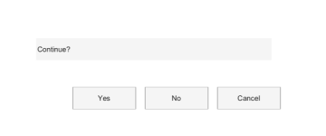

# questdlg

Cree une boite de dialogue de question.

## 📝 Syntaxe

- answer = questdlg(question)
- answer = questdlg(question, title)
- answer = questdlg(question, title, btn1, btn2, default)
- answer = questdlg(question, title, btn1, btn2, btn3, default)

## 📥 Argument d'entrée

- question - Question text. Use a character vector, string, or cell array of character vectors.

## 📤 Argument de sortie

- answer - Selected button label. Returns an empty character vector when the dialog is dismissed.

## 📄 Description

questdlg displays a question dialog and returns the selected button label.

## 💡 Exemples

Apercu d une boite de question.

```matlab
f = dialog('Name', 'Question', 'WindowStyle', 'normal', 'Position', [100 100 360 150]);
uicontrol(f, 'Style', 'text', 'String', 'Continue?', 'Position', [40 84 260 24]);
uicontrol(f, 'Style', 'pushbutton', 'String', 'Yes', 'Position', [80 30 70 24]);
uicontrol(f, 'Style', 'pushbutton', 'String', 'No', 'Position', [160 30 70 24]);
uicontrol(f, 'Style', 'pushbutton', 'String', 'Cancel', 'Position', [240 30 70 24]);
```


Use custom button labels.

```matlab
answer = questdlg('Save changes?', 'Confirm', 'Save', 'Discard', 'Cancel', 'Save');
disp(answer)
```

## 🔗 Voir aussi

[msgbox](../gui/msgbox.md), [uiconfirm](../gui/uiconfirm.md).

## 🕔 Historique

| Version | 📄 Description                         |
| ------- | -------------------------------------- |
| 2.0.0   | version aide API dialogue mise a jour. |

<!--
## 👤 Auteur

Allan CORNET
-->
