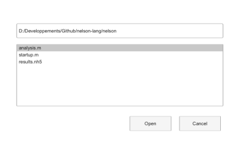

# uigetfile

Ouvre une boite de dialogue de selection de fichier.

## 📝 Syntaxe

- [file, path, index] = uigetfile
- [file, path, index] = uigetfile(filter)
- [file, path, index] = uigetfile(filter, title)
- [file, path, index] = uigetfile(filter, title, defaultName)

## 📥 Argument d'entrée

- filter - File filter string or cell array. Examples: '\*.m', '\*.nh5', or 'All Files (\*)'.

## 📤 Argument de sortie

- file - Selected file name, or 0 when canceled.

## 📄 Description


uigetfile lets the user choose an existing file.

## 💡 Exemples

Apercu d une boite d ouverture de fichier.

```matlab
f = dialog('Name', 'Select a script', 'WindowStyle', 'normal', 'Position', [100 100 420 250]);
uicontrol(f, 'Style', 'edit', 'String', pwd(), 'Position', [28 186 350 24]);
uicontrol(f, 'Style', 'listbox', 'String', {'analysis.m', 'startup.m', 'results.nh5'}, 'Value', 1, 'Position', [28 70 350 105]);
uicontrol(f, 'Style', 'pushbutton', 'String', 'Open', 'Position', [220 28 70 24]);
uicontrol(f, 'Style', 'pushbutton', 'String', 'Cancel', 'Position', [304 28 70 24]);
```

Open a file picker with several filters.

```matlab
filters = {'*.m', 'Nelson files'; '*.*', 'All files'};
[file, path, index] = uigetfile(filters, 'Open source file');
if ~isequal(file, 0), disp({file, path, index}); end
```


## 🔗 Voir aussi

[uiputfile](../gui/uiputfile.md), [uigetdir](../gui/uigetdir.md), [uiopen](../gui/uiopen.md).

## 🕔 Historique

| Version | 📄 Description     |
| ------- | --------------- |
| 2.0.0   | version aide API dialogue mise a jour. |

<!--
## 👤 Auteur

Allan CORNET
-->
