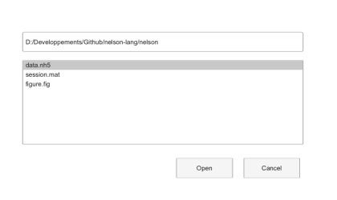

# uiopen

Charge un fichier selectionne depuis une boite de dialogue.

## 📝 Syntaxe

- uiopen
- uiopen(filter)
- uiopen(filter, option)

## 📥 Argument d'entrée

- filter - File filter passed to the file picker.

## 📄 Description

uiopen asks for a file and loads it into the caller workspace using the existing load behavior.

## 💡 Exemples

Apercu d une boite d ouverture de fichier.

```matlab
f = dialog('Name', 'Open file', 'WindowStyle', 'normal', 'Position', [100 100 420 250]);
uicontrol(f, 'Style', 'edit', 'String', pwd(), 'Position', [28 186 350 24]);
uicontrol(f, 'Style', 'listbox', 'String', {'data.nh5', 'session.mat', 'figure.fig'}, 'Value', 1, 'Position', [28 70 350 105]);
uicontrol(f, 'Style', 'pushbutton', 'String', 'Open', 'Position', [220 28 70 24]);
uicontrol(f, 'Style', 'pushbutton', 'String', 'Cancel', 'Position', [304 28 70 24]);
```


Open a data file using the default picker.

```matlab
uiopen()
```

## 🔗 Voir aussi

[uisave](../gui/uisave.md), [uigetfile](../gui/uigetfile.md).

## 🕔 Historique

| Version | 📄 Description                         |
| ------- | -------------------------------------- |
| 2.0.0   | version aide API dialogue mise a jour. |

<!--
## 👤 Auteur

Allan CORNET
-->
