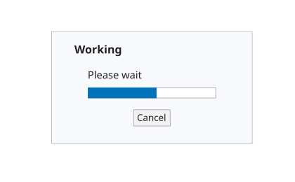

# uiprogressdlg

Cree une boite de progression UI.

## 📝 Syntaxe

- d = uiprogressdlg(parent)
- d = uiprogressdlg(parent, Name, Value)

## 📥 Argument d'entrée

- parent - Handle de figure UI parent, generalement cree avec uifigure.
- Name, Value - Paires optionnelles. 'Title' definit le titre, 'Message' definit le texte, 'Value' definit la progression de 0 a 1 et 'Indeterminate' cree une progression indeterminee si la valeur vaut true.

## 📤 Argument de sortie

- d - Handle de la boite de dialogue.

## 📄 Description


uiprogressdlg affiche la progression d'une operation. 

Dans un bureau web, la boite de dialogue est non bloquante. Utilisez les proprietes windowTitle, labelText, value, minimum, maximum et visible du handle pour la mettre a jour ou la masquer.

## 💡 Exemples

Apercu rendu pour l'image d'aide.

```matlab
f = figure('Name', 'Progress preview', 'Position', [100 100 420 260], 'Color', [1 1 1]);
axis([0 1 0 1]); axis off; hold on;
patch([0.06 0.94 0.94 0.06], [0.12 0.12 0.88 0.88], [0.97 0.98 0.99], 'EdgeColor', [0.62 0.65 0.68]);

text(0.16, 0.76, 'Working', 'FontSize', 12, 'FontWeight', 'bold');
text(0.22, 0.58, 'Please wait', 'FontSize', 11);
patch([0.22 0.78 0.78 0.22], [0.43 0.43 0.50 0.50], [1 1 1], 'EdgeColor', [0.55 0.55 0.55]);
patch([0.22 0.52 0.52 0.22], [0.43 0.43 0.50 0.50], [0.00 0.45 0.74], 'EdgeColor', [0.00 0.45 0.74]);
patch([0.42 0.58 0.58 0.42], [0.24 0.24 0.35 0.35], [0.95 0.95 0.95], 'EdgeColor', [0.55 0.55 0.55]);
text(0.50, 0.29, 'Cancel', 'HorizontalAlignment', 'center', 'FontSize', 10);
drawnow();
```

Afficher une progression indeterminee.

```matlab
f = uifigure('Visible', 'off', 'Name', 'Import');
d = uiprogressdlg(f, 'Title', 'Import', 'Message', 'Reading data', 'Indeterminate', true);
close(f)
```
Creer, mettre a jour et supprimer une boite de dialogue de progression.

```matlab
f = uifigure('Visible', 'off', 'Name', 'Import');
d = uiprogressdlg(f, 'Title', 'Import', 'Message', 'Reading data', 'Value', 0.25);
set(d, 'value', 60);
set(d, 'labelText', 'Writing data');
delete(d);
close(f)
```


## 🔗 Voir aussi

[waitbar](../gui/waitbar.md), [uialert](../gui/uialert.md).

## 🕔 Historique

| Version | 📄 Description     |
| ------- | --------------- |
| 2.0.0   | version aide API dialogue mise a jour. |

<!--
## 👤 Auteur

Allan CORNET
-->
