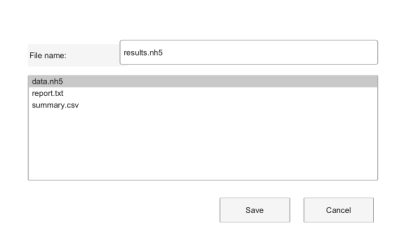

# uiputfile

Ouvre une boite de dialogue d'enregistrement de fichier.

## 📝 Syntaxe

- [file, path, index] = uiputfile
- [file, path, index] = uiputfile(filter)
- [file, path, index] = uiputfile(filter, title)
- [file, path, index] = uiputfile(filter, title, defaultName)

## 📥 Argument d'entrée

- filter - File filter string or cell array. Examples: '\*.nh5' or 'All Files (\*)'.

## 📤 Argument de sortie

- file - Selected file name, or 0 when canceled.

## 📄 Description

uiputfile lets the user choose a destination file.

## 💡 Exemples

Apercu d une boite d enregistrement de fichier.

```matlab
f = dialog('Name', 'Save data as', 'WindowStyle', 'normal', 'Position', [100 100 420 250]);
uicontrol(f, 'Style', 'text', 'String', 'File name:', 'Position', [28 184 100 22]);
uicontrol(f, 'Style', 'edit', 'String', 'results.nh5', 'Position', [120 186 258 24]);
uicontrol(f, 'Style', 'listbox', 'String', {'data.nh5', 'report.txt', 'summary.csv'}, 'Value', 1, 'Position', [28 70 350 105]);
uicontrol(f, 'Style', 'pushbutton', 'String', 'Save', 'Position', [220 28 70 24]);
uicontrol(f, 'Style', 'pushbutton', 'String', 'Cancel', 'Position', [304 28 70 24]);
```


Suggest a default output file name.

```matlab
[file, path] = uiputfile('*.nh5', 'Save results', 'results.nh5');
if ~isequal(file, 0), disp([path file]); end
```

## 🔗 Voir aussi

[uigetfile](../gui/uigetfile.md), [uisave](../gui/uisave.md).

## 🕔 Historique

| Version | 📄 Description                         |
| ------- | -------------------------------------- |
| 2.0.0   | version aide API dialogue mise a jour. |

<!--
## 👤 Auteur

Allan CORNET
-->
