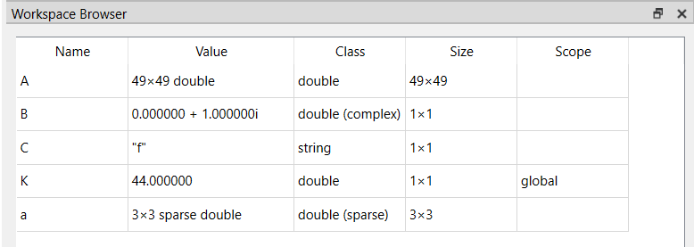

# workspace

Explorateur d'espace de travail

## 📝 Syntaxe

- workspace

## 📄 Description

L'explorateur d'espace de travail vous permet d'observer et de gérer activement le contenu de l'espace de travail dans Nelson, offrant un accès et un contrôle sur chaque variable ou objet présent. 

## 🔗 Voir aussi

[commandhistory](../gui/commandhistory.md), [filebrowser](../gui/filebrowser.md).

## 🕔 Historique

| Version | 📄 Description     |
| ------- | --------------- |
| 1.1.0   | version initiale |

<!--
## 👤 Auteur

Allan CORNET
-->
