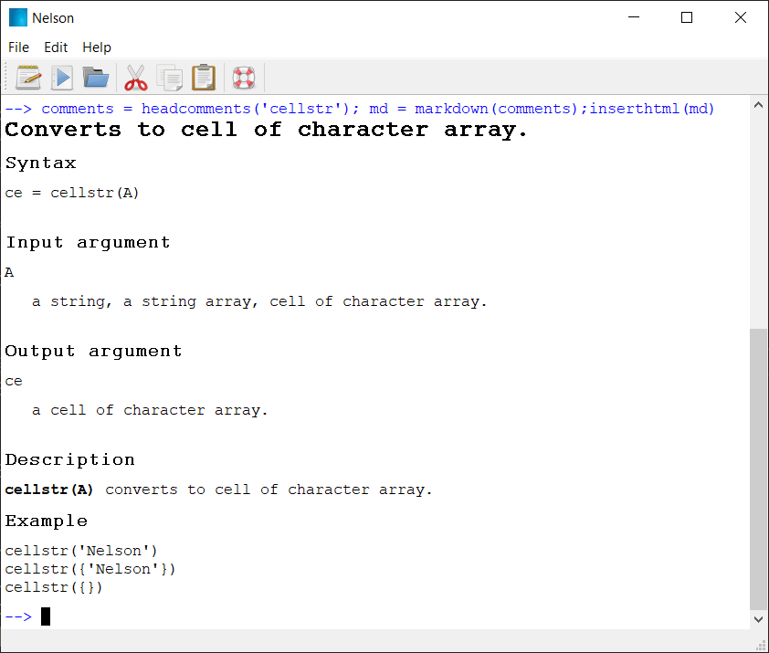

# headcomments

Affiche les commentaires d'en-tête d'une fonction Nelson.

## 📝 Syntaxe

- headcomments(function_name)
- ce = headcomments(function_name)

## 📥 Argument d'entrée

- function_name - une chaîne : nom de la fonction ou nom de fichier .m.

## 📤 Argument de sortie

- ce - une cellule de chaînes

## 📄 Description

<b>head_comments</b> affiche les commentaires d'en-tête d'une fonction.

Les commentaires sont lus depuis le fichier .m associé.

Les fonctions prédéfinies de Nelson n'ont pas de commentaires d'en-tête.

## 💡 Exemple

```matlab
comments = headcomments('cellstr'); md = markdown(comments);inserthtml(md)
```



## 🔗 Voir aussi

[doc](../help_tools/doc.md), [markdown](../help_tools/markdown.md), [inserthtml](../gui/inserthtml.md), [which](../functions_manager/which.md).

## 🕔 Historique

| Version | 📄 Description   |
| ------- | ---------------- |
| 1.0.0   | version initiale |

<!--
## 👤 Auteur

Allan CORNET
-->
