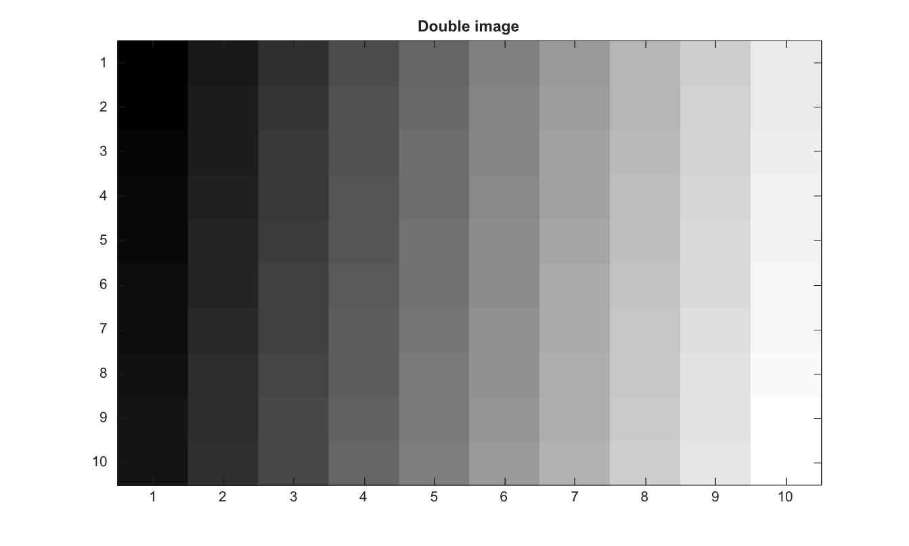

# im2double

Convertit une image en précision double.

## 📝 Syntaxe

- IM = im2double(I)
- IM = im2double(I,'indexed')

## 📥 Argument d'entrée

- I - Image d'entrée : scalaire, vecteur, matrice ou tableau multidimensionnel de type single, double, int16, uint8, uint16 ou logical.

## 📤 Argument de sortie

- IM - L'image convertie est renvoyée sous forme d'un tableau numérique ayant les mêmes dimensions que l'image d'entrée I et de type double.

## 📄 Description

<b>IM = im2double(I)</b> convertit l'image d'entrée I au format en précision double. L'image d'entrée IM peut être une image en niveaux de gris, en couleurs vraies ou binaire. Lors de la conversion, <b>im2double</b> remet à l'échelle les valeurs de pixels depuis leur format entier d'origine vers une plage flottante [0, 1].

Pour une image indexée, <b>IM = im2double(I, 'indexed')</b> convertit également l'image I en précision double, mais ajoute un décalage de 1 aux valeurs de pixels lors de la conversion depuis les types entiers.

Les images indexees peuvent etre des tableaux uint8, uint16, double, single ou logical.

## 💡 Exemple

Convertir une image uint8 en precision double

```matlab
I=reshape(uint8(linspace(1,255,100)),[10 10]);
IM=im2double(I);
figure; imagesc(IM); g=linspace(0,1,64)'; colormap([g g g]); title('Double image');
```



## 🔗 Voir aussi

[double](../../../double/double.md), [imread](../../../graphics_io/imread.md), [im2single](../../../image_processing/im2single.md), [im2uint8](../../../image_processing/im2uint8.md), [im2uint16](../../../image_processing/im2uint16.md), [im2gray](../../../image_processing/im2gray.md).

## 🕔 Historique

| Version | 📄 Description   |
| ------- | ---------------- |
| 1.0.0   | version initiale |

<!--
## 👤 Auteur

Allan CORNET
-->
