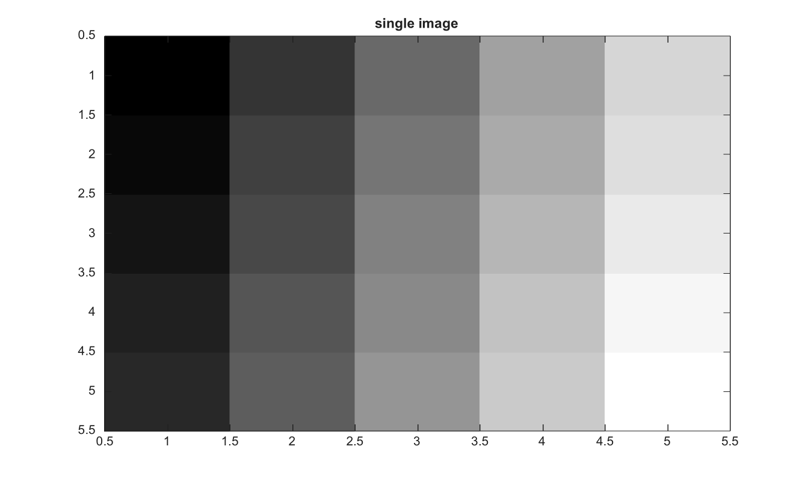

# im2single

Convertit une image en precision simple.

## 📝 Syntaxe

- J = im2single(I)
- J = im2single(I, 'indexed')

## 📥 Argument d'entrée

- I - Image d'entree.
- 'indexed' - Mode optionnel pour les images indexees. Les valeurs uint8 et uint16 sont converties en indices single en base un.

## 📤 Argument de sortie

- J - Image convertie en precision simple.

## 📄 Description


Convertit une image en precision simple. 

Pour les images indexees, les entrees uint8 et uint16 sont decalees de un dans la sortie single.

## 💡 Exemple

Convertir un tableau uint8 en precision simple

```matlab
I=reshape(uint8(linspace(1,255,25)),[5 5]);
J=im2single(I);
figure; imagesc(J); g=linspace(0,1,64)'; colormap([g g g]); title('single image');
```



## 🔗 Voir aussi

[im2double](../../../image_processing/1_image_basics/1_image_types_color/im2double.md), [im2uint8](../../../image_processing/1_image_basics/1_image_types_color/im2uint8.md), [im2uint16](../../../image_processing/1_image_basics/1_image_types_color/im2uint16.md).

## 🕔 Historique

| Version | 📄 Description     |
| ------- | --------------- |
| 2.0.0   | version initiale |

<!--
## 👤 Auteur

Allan CORNET
-->
