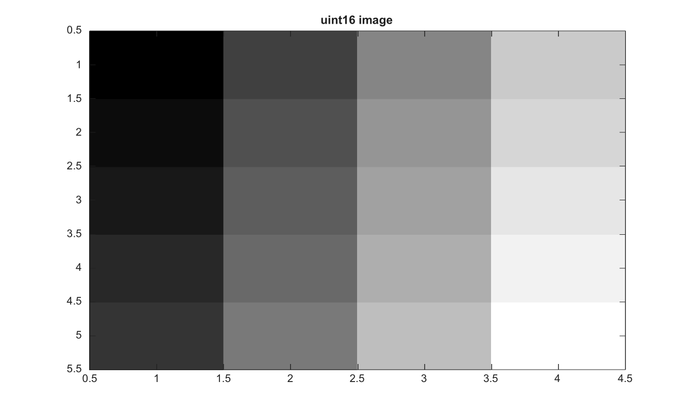

# im2uint16

Convertit une image en entier non signe 16 bits.

## 📝 Syntaxe

- J = im2uint16(I)
- J = im2uint16(I, 'indexed')

## 📥 Argument d'entrée

- I - Image d'entree. Les classes d'intensite prises en charge sont double, single, logical, uint8, uint16 et int16.
- 'indexed' - Mode optionnel pour les images indexees. Les entrees flottantes utilisent des indices en base un et les entrees entieres utilisent des indices en base zero.

## 📤 Argument de sortie

- J - Image convertie en uint16.

## 📄 Description


Convertit une image en entier non signe 16 bits. 

Pour les images indexees, les entrees entieres sont traitees comme des indices base zero et les entrees double comme des indices base un.

## 💡 Exemple

Convertir un tableau double en uint16

```matlab
I=reshape(linspace(0,1,20),[5 4]);
J=im2uint16(I);
figure; imagesc(J); g=linspace(0,1,64)'; colormap([g g g]); title('uint16 image');
```



## 🔗 Voir aussi

[im2uint8](../../../image_processing/1_image_basics/1_image_types_color/im2uint8.md), [im2single](../../../image_processing/1_image_basics/1_image_types_color/im2single.md), [im2double](../../../image_processing/1_image_basics/1_image_types_color/im2double.md).

## 🕔 Historique

| Version | 📄 Description     |
| ------- | --------------- |
| 2.0.0   | version initiale |

<!--
## 👤 Auteur

Allan CORNET
-->
