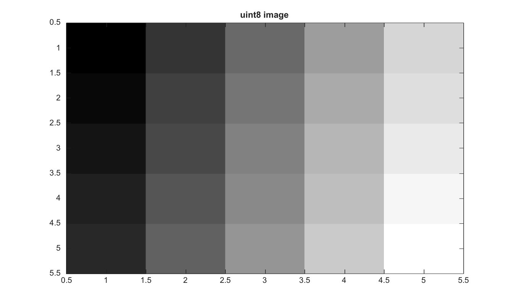

# im2uint8

Convertit une image en entier non signe 8 bits.

## 📝 Syntaxe

- J = im2uint8(I)
- J = im2uint8(I, 'indexed')

## 📥 Argument d'entrée

- I - Image d'entree. Les classes d'intensite prises en charge sont double, single, logical, uint8, uint16 et int16.
- 'indexed' - Mode optionnel pour les images indexees. Les entrees flottantes utilisent des indices en base un et les entrees entieres utilisent des indices en base zero.

## 📤 Argument de sortie

- J - Image convertie en uint8.

## 📄 Description

Convertit une image en entier non signe 8 bits.

Pour les images indexees, les entrees entieres sont traitees comme des indices base zero et les entrees double comme des indices base un.

## 💡 Exemple

Convertir un tableau uint16 en uint8

```matlab
I=reshape(uint16(linspace(0,65535,25)),[5 5]);
J=im2uint8(I);
figure; imagesc(J); g=linspace(0,1,64)'; colormap([g g g]); title('uint8 image');
```



## 🔗 Voir aussi

[im2uint16](../../../image_processing/im2uint16.md), [im2single](../../../image_processing/im2single.md), [im2double](../../../image_processing/im2double.md).

## 🕔 Historique

| Version | 📄 Description   |
| ------- | ---------------- |
| 2.0.0   | version initiale |

<!--
## 👤 Auteur

Allan CORNET
-->
