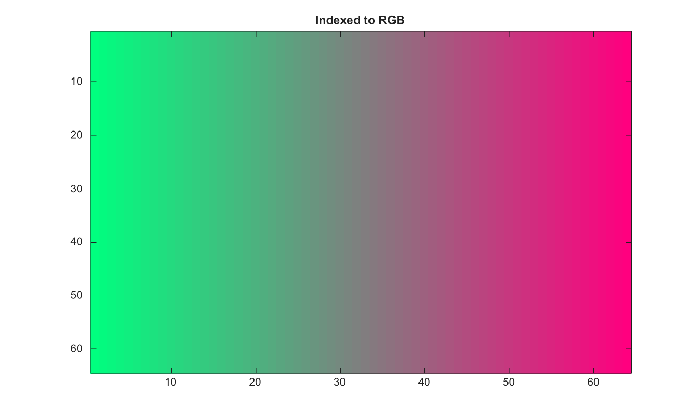

# ind2rgb

Convertit une image indexee en RGB avec une palette.

## 📝 Syntaxe

- RGB = ind2rgb(X, map)

## 📥 Argument d'entrée

- X - Image indexee. Les tableaux entiers et logiques utilisent des indices en base zero ; les tableaux double et single utilisent des indices en base un.
- map - Colormap avec au moins trois colonnes.

## 📤 Argument de sortie

- RGB - Image RGB double construite avec les trois premieres colonnes de map.

## 📄 Description

Convertit une image indexee en RGB avec les trois premieres colonnes d'une palette. Les images indexees entieres et logiques utilisent des indices en base zero. Les images indexees double et single utilisent des indices en base un. Les indices entiers hors de la palette sont bornes a la ligne valide la plus proche. Les images indexees vides renvoient un tableau RGB vide.

## 💡 Exemples

Convertir une image indexee en RGB

```matlab
X=repmat(uint8(0:63),64,1);
v=linspace(0,1,64)'; map=[v 1-v 0.5*ones(64,1)];
RGB=ind2rgb(X,map);
figure; image(RGB); title('Indexed to RGB');
```


Borner les indices hors de la palette

```matlab
map=[1 0 0; 0 1 0; 0 0 1];
RGB=ind2rgb([0 1 2 5],map)
```

## 🔗 Voir aussi

[ind2gray](../../../image_processing/ind2gray.md), [rgb2gray](../../../image_processing/rgb2gray.md).

## 🕔 Historique

| Version | 📄 Description   |
| ------- | ---------------- |
| 2.0.0   | version initiale |

<!--
## 👤 Auteur

Allan CORNET
-->
