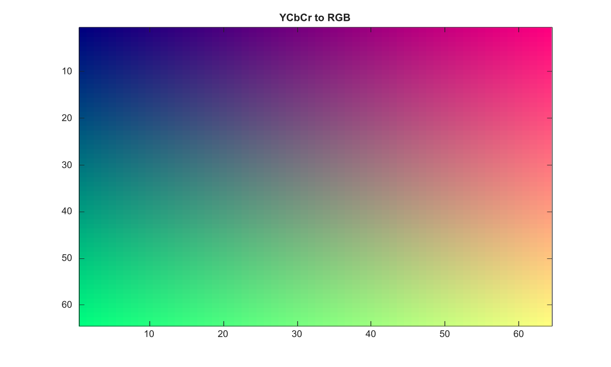

# ycbcr2rgb

Convertit des valeurs couleur YCbCr en valeurs RGB.

## 📝 Syntaxe

- RGB = ycbcr2rgb(YCBCR)

## 📥 Argument d'entrée

- YCBCR - Image YCbCr m-by-n-by-3, ou colormap double c-by-3 avec des valeurs dans l'intervalle [0, 1].

## 📤 Argument de sortie

- RGB - Image ou colormap RGB. Les entrees uint8, uint16 et single conservent leur classe ; les autres entrees renvoient double.

## 📄 Description


Convertit des valeurs couleur YCbCr en valeurs RGB. Les entrees peuvent etre des images m-by-n-by-3 ou des colormaps double c-by-3 avec des valeurs dans l intervalle [0, 1].

## 💡 Exemple

Convertir une image YCbCr en RGB

```matlab
RGB=zeros(64,64,3);
[X,Y]=meshgrid(linspace(0,1,64),linspace(0,1,64));
RGB(:,:,1)=X; RGB(:,:,2)=Y; RGB(:,:,3)=0.5;
RGB2=ycbcr2rgb(rgb2ycbcr(RGB));
figure; image(RGB2); title('YCbCr to RGB');
```



## 🔗 Voir aussi

[rgb2ycbcr](../../../image_processing/1_image_basics/1_image_types_color/rgb2ycbcr.md), [hsv2rgb](../../../image_processing/1_image_basics/1_image_types_color/hsv2rgb.md).

## 🕔 Historique

| Version | 📄 Description     |
| ------- | --------------- |
| 2.0.0   | version initiale |

<!--
## 👤 Auteur

Allan CORNET
-->
