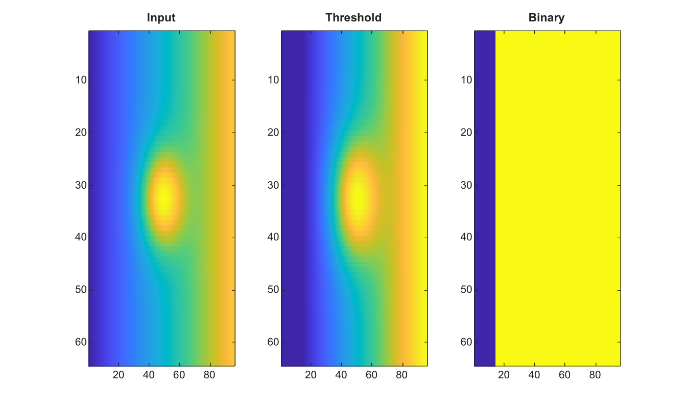

# adaptthresh

Calcule un seuil adaptatif d image.

## 📝 Syntaxe

- T = adaptthresh(I)
- T = adaptthresh(I, sensitivity)
- T = adaptthresh(\_\_, 'ForegroundPolarity', polarity)
- T = adaptthresh(\_\_, 'NeighborhoodSize', size)
- T = adaptthresh(\_\_, 'Statistic', statistic)

## 📥 Argument d'entrée

- I - Image d'entree.
- sensitivity - Valeur scalaire de sensibilite. La valeur par defaut est 0.5.
- 'ForegroundPolarity' - Polarite du premier plan, 'bright' ou 'dark'.
- 'NeighborhoodSize' - Taille de voisinage a deux elements utilisee pour les statistiques locales.
- 'Statistic' - Statistique locale : 'mean', 'gaussian' ou 'median'.

## 📤 Argument de sortie

- T - Image de seuil adaptatif avec des valeurs dans l'intervalle [0, 1].

## 📄 Description


Calcule une image de seuil local pour binarisation adaptative. Les polarites de premier plan prises en charge sont bright et dark. Les statistiques prises en charge sont mean, gaussian et median.

## 💡 Exemple

Binariser une image avec un seuil local

```matlab
[X,Y]=meshgrid(linspace(-1,1,96),linspace(-1,1,64));
I=0.25+0.35*X+0.45*exp(-12*(X.^2+Y.^2));
T=adaptthresh(I,0.45,'NeighborhoodSize',[15 15]);
BW=I>T;
figure; subplot(1,3,1); imagesc(I); title('Input');
subplot(1,3,2); imagesc(T); title('Threshold');
subplot(1,3,3); imagesc(BW); title('Binary');
```



## 🔗 Voir aussi

[imbinarize](../../../image_processing/1_image_basics/2_contrast_thresholding/imbinarize.md), [graythresh](../../../image_processing/1_image_basics/2_contrast_thresholding/graythresh.md).

## 🕔 Historique

| Version | 📄 Description     |
| ------- | --------------- |
| 2.0.0   | version initiale |

<!--
## 👤 Auteur

Allan CORNET
-->
