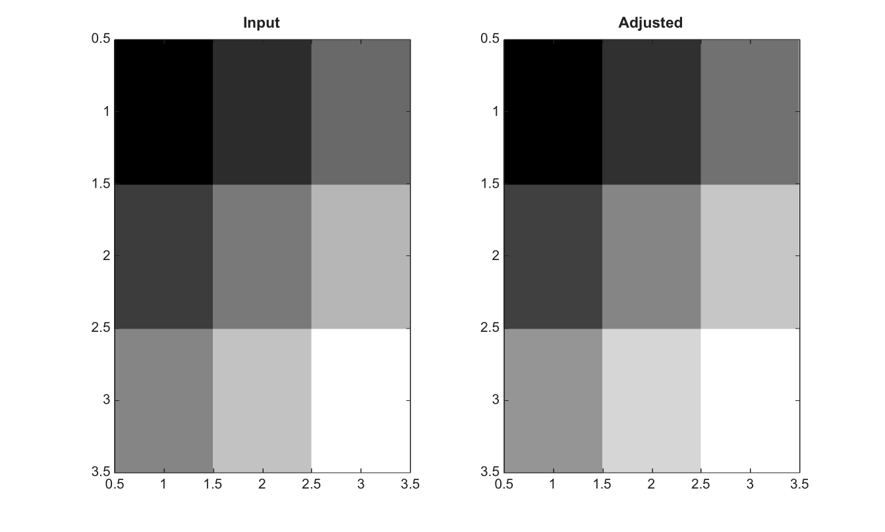

# imadjust

Ajuste les intensites d une image.

## 📝 Syntaxe

- J = imadjust(I)
- J = imadjust(I, in)
- J = imadjust(I, in, out)
- J = imadjust(I, in, out, gamma)

## 📥 Argument d'entrée

- I - Image d'entree en niveaux de gris, image RGB ou colormap double.
- in - Limites d'intensite d'entree, sous forme de vecteur 2-by-1 ou de matrice 2-by-N par canal.
- out - Limites d'intensite de sortie, sous forme de vecteur 2-by-1 ou de matrice 2-by-N par canal.
- gamma - Correction gamma scalaire ou vecteur par canal.

## 📤 Argument de sortie

- J - Image ou colormap ajustee.

## 📄 Description

Ajuste les intensites d une image. Les images en niveaux de gris utilisent des limites 2-by-1; les images RGB peuvent utiliser des limites 2-by-3 et des valeurs gamma par canal.

## 💡 Exemple

Ajuster le contraste d une image en niveaux de gris peu contrastee

```matlab
I=uint8([50 80 120; 90 130 170; 140 180 220]);
J=imadjust(I,[0.2;0.8],[]);
figure; subplot(1,2,1); imagesc(I); g=linspace(0,1,64)'; colormap([g g g]); title('Input');
subplot(1,2,2); imagesc(J); g=linspace(0,1,64)'; colormap([g g g]); title('Adjusted');
```



## 🔗 Voir aussi

[stretchlim](../../../image_processing/stretchlim.md), [imhist](../../../image_processing/imhist.md), [imcomplement](../../../image_processing/imcomplement.md).

## 🕔 Historique

| Version | 📄 Description   |
| ------- | ---------------- |
| 2.0.0   | version initiale |

<!--
## 👤 Auteur

Allan CORNET
-->
