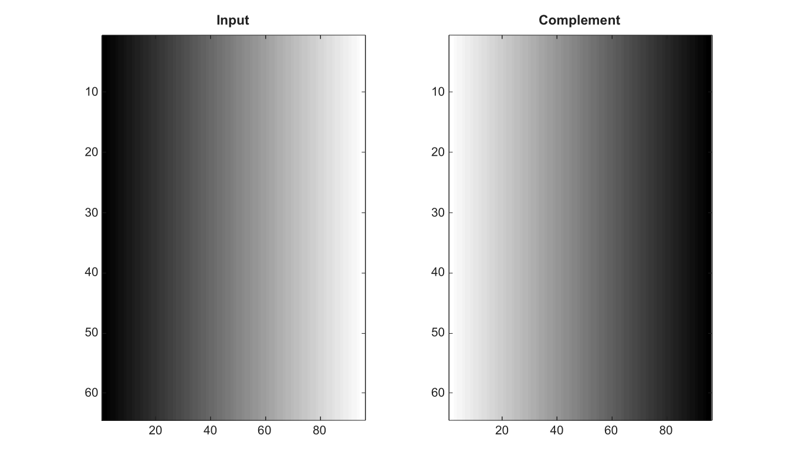

# imcomplement

Calcule le complement des valeurs d une image.

## 📝 Syntaxe

- J = imcomplement(I)

## 📥 Argument d'entrée

- I - Image d'entree.

## 📤 Argument de sortie

- J - Image complementee avec la meme classe que I.

## 📄 Description


Calcule le complement des valeurs d une image. Les valeurs logiques sont inversees. Les images entieres non signees sont complementees sur toute la plage de leur classe. Les images entieres signees conservent leur classe et sont complementees sur la plage signee.

## 💡 Exemples

Calculer le complement d une image

```matlab
I=repmat(linspace(0,1,96),64,1);
J=imcomplement(I);
figure; subplot(1,2,1); imagesc(I); g=linspace(0,1,64)'; colormap([g g g]); title('Input');
subplot(1,2,2); imagesc(J); g=linspace(0,1,64)'; colormap([g g g]); title('Complement');
```

Complementer des valeurs entieres signees

```matlab
J = imcomplement(int16([-32768 0 32767]))
```


## 🔗 Voir aussi

[imadjust](../../../image_processing/1_image_basics/2_contrast_thresholding/imadjust.md), [imbinarize](../../../image_processing/1_image_basics/2_contrast_thresholding/imbinarize.md).

## 🕔 Historique

| Version | 📄 Description     |
| ------- | --------------- |
| 2.0.0   | version initiale |

<!--
## 👤 Auteur

Allan CORNET
-->
