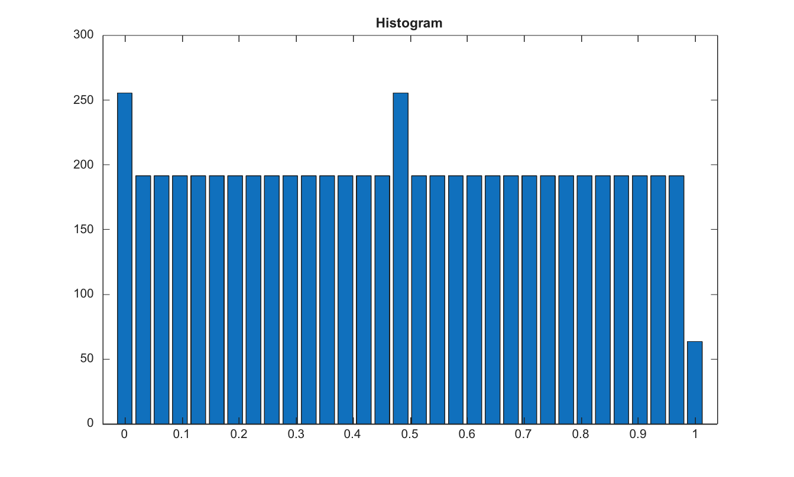

# imhist

Calcule les effectifs de l histogramme d image.

## 📝 Syntaxe

- counts = imhist(I)
- [counts, binLocations] = imhist(I)
- [counts, binLocations] = imhist(I, n)

## 📥 Argument d'entrée

- I - Image d'entree d'intensite ou logique.
- n - Nombre entier positif de bins d'histogramme.

## 📤 Argument de sortie

- counts - Effectifs de l'histogramme sous forme de vecteur colonne.
- binLocations - Emplacements des bins dans l'echelle native de l'image.

## 📄 Description

Calcule les effectifs de l histogramme d image. Les emplacements de bins utilisent l echelle native des images entieres et l intervalle [0, 1] pour les images flottantes et logiques.

## 💡 Exemple

Afficher un histogramme d image

```matlab
I=repmat(linspace(0,1,96),64,1);
[counts,bins]=imhist(I,32);
figure; bar(bins,counts); title('Histogram');
```



## 🔗 Voir aussi

[imadjust](../../../image_processing/imadjust.md), [graythresh](../../../image_processing/graythresh.md).

## 🕔 Historique

| Version | 📄 Description   |
| ------- | ---------------- |
| 2.0.0   | version initiale |

<!--
## 👤 Auteur

Allan CORNET
-->
