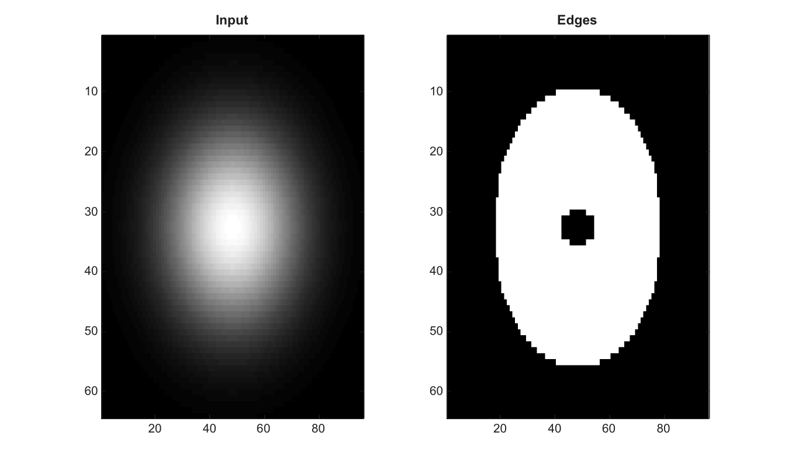

# edge

Detecte les contours dans une image en niveaux de gris.

## 📝 Syntaxe

- BW = edge(I)
- BW = edge(I, method)
- BW = edge(I, method, thresh)
- BW = edge(I, method, thresh, direction)
- BW = edge(I, method, thresh, sigma)
- [BW, thresh] = edge(...)

## 📥 Argument d'entrée

- I - Image d'entree en niveaux de gris ou RGB.
- method - Methode de detection : 'sobel', 'prewitt', 'roberts', 'log' ou 'canny'. La valeur par defaut est 'sobel'.
- thresh - Seuil de detection. Pour 'canny', il peut etre un scalaire ou un vecteur a deux elements.
- direction - Direction utilisee avec 'sobel', 'prewitt' et 'roberts' : 'horizontal', 'vertical' ou 'both'.
- sigma - Echelle gaussienne positive utilisee avec 'log' et 'canny'.

## 📤 Argument de sortie

- BW - Image logique dont les pixels vrais indiquent les contours detectes.
- thresh - Seuil utilise par le detecteur.

## 📄 Description


Detecte les contours dans une image en niveaux de gris. Les methodes prises en charge sont sobel, prewitt, roberts, log et canny. Les methodes sobel, prewitt et roberts acceptent horizontal, vertical ou both comme direction. Les methodes log et canny acceptent un sigma scalaire positif. Le seuil canny peut etre scalaire ou un vecteur a deux elements.

## 💡 Exemple

Detecter les contours

```matlab
[X,Y]=meshgrid(linspace(-1,1,96),linspace(-1,1,64));
I=exp(-4*(X.^2+Y.^2));
BW=edge(I,'sobel');
figure; subplot(1,2,1); imagesc(I); g=linspace(0,1,64)'; colormap([g g g]); title('Input');
subplot(1,2,2); imagesc(BW); g=linspace(0,1,64)'; colormap([g g g]); title('Edges');
```



## 🔗 Voir aussi

[imfilter](../../../image_processing/1_image_basics/3_filtering_edges/imfilter.md), [fspecial](../../../image_processing/1_image_basics/3_filtering_edges/fspecial.md).

## 🕔 Historique

| Version | 📄 Description     |
| ------- | --------------- |
| 2.0.0   | version initiale |

<!--
## 👤 Auteur

Allan CORNET
-->
