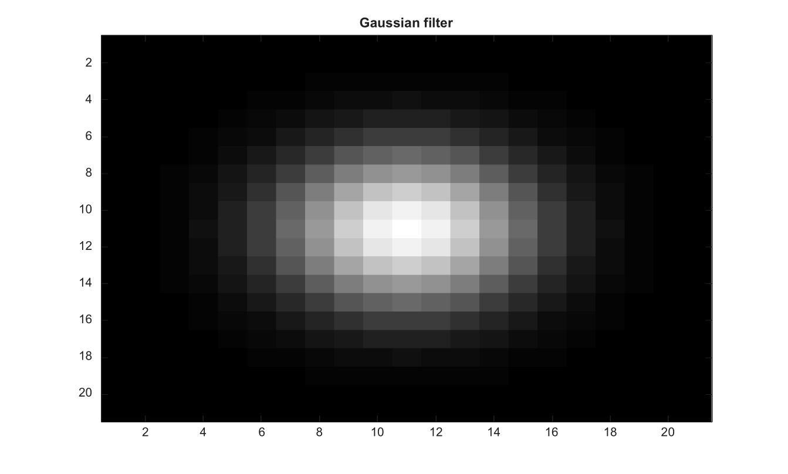

# fspecial

Cree des filtres image 2D predefinis.

## 📝 Syntaxe

- H = fspecial(type)
- H = fspecial('average', hsize)
- H = fspecial('disk', radius)
- H = fspecial('gaussian', hsize, sigma)

## 📥 Argument d'entrée

- type - Nom de famille de filtre : 'average', 'disk', 'gaussian', 'sobel', 'prewitt', 'laplacian' ou 'log'.
- hsize - Taille du filtre pour 'average', 'gaussian' et 'log'. Elle peut etre un scalaire ou un vecteur a deux elements entiers positifs.
- radius - Rayon non negatif du disque utilise avec le type 'disk'.
- sigma - Ecart type positif utilise avec le type 'gaussian' ou 'log'.
- alpha - Scalaire fini dans l'intervalle [0, 1] utilise avec le type 'laplacian'.

## 📤 Argument de sortie

- H - Noyau de filtre 2D predefini renvoye sous forme de matrice double.

## 📄 Description

Cree des filtres image 2D predefinis. Les types pris en charge incluent average, disk, gaussian, sobel, prewitt, laplacian et log.

## 💡 Exemple

Creer et afficher un filtre gaussien

```matlab
H=fspecial('gaussian',[21 21],3);
figure; imagesc(H); g=linspace(0,1,64)'; colormap([g g g]); title('Gaussian filter');
```



## 🔗 Voir aussi

[imfilter](../../../image_processing/imfilter.md), [imgaussfilt](../../../image_processing/imgaussfilt.md).

## 🕔 Historique

| Version | 📄 Description   |
| ------- | ---------------- |
| 2.0.0   | version initiale |

<!--
## 👤 Auteur

Allan CORNET
-->
