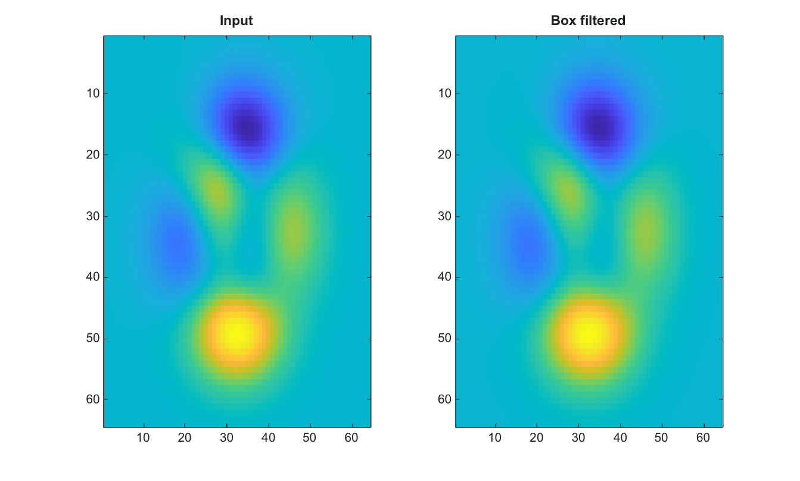

# imboxfilt

Applique un filtrage par moyenne locale.

## 📝 Syntaxe

- B = imboxfilt(A)
- B = imboxfilt(A, filterSize)
- B = imboxfilt(\_\_, 'Padding', pad)
- B = imboxfilt(\_\_, 'NormalizationFactor', factor)

## 📥 Argument d'entrée

- A - Image 2-D numerique/logique ou image RGB.
- filterSize - Scalaire entier positif ou vecteur a deux elements. La valeur par defaut est [3 3].
- 'Padding' - Methode de padding ou valeur scalaire finie de remplissage transmise a imfilter. La valeur par defaut est replicate.
- 'NormalizationFactor' - Scalaire numerique fini multiplie par le noyau de moyenne locale. La valeur par defaut calcule une moyenne locale.

## 📤 Argument de sortie

- B - Image filtree par moyenne locale.

## 📄 Description

Applique un filtrage par moyenne locale. FilterSize doit contenir des entiers positifs. Par defaut, le filtre calcule une moyenne locale avec un padding par replication. Utiliser NormalizationFactor egal a 1 pour calculer des sommes locales.

## 💡 Exemples

Appliquer un filtrage par moyenne locale

```matlab
I=peaks(64);
J=imboxfilt(I,[5 5]);
figure; subplot(1,2,1); imagesc(I); title('Input');
subplot(1,2,2); imagesc(J); title('Box filtered');
```


Calculer des sommes locales avec padding nul

```matlab
A = [1 2; 3 4];
S = imboxfilt(A, [2 2], 'Padding', 0, 'NormalizationFactor', 1)
```

## 🔗 Voir aussi

[imgaussfilt](../../../image_processing/imgaussfilt.md), [imfilter](../../../image_processing/imfilter.md).

## 🕔 Historique

| Version | 📄 Description   |
| ------- | ---------------- |
| 2.0.0   | version initiale |

<!--
## 👤 Auteur

Allan CORNET
-->
