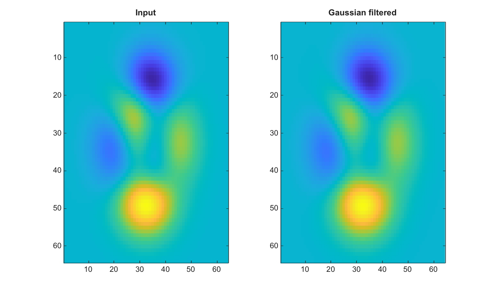

# imgaussfilt

Applique un filtrage gaussien a une image.

## 📝 Syntaxe

- B = imgaussfilt(A)
- B = imgaussfilt(A, sigma)
- B = imgaussfilt(\_\_, 'FilterSize', filterSize)
- B = imgaussfilt(\_\_, 'Padding', pad)
- B = imgaussfilt(\_\_, 'FilterDomain', domain)

## 📥 Argument d'entrée

- A - Image 2-D en niveaux de gris, RGB, ou RGBA, numerique ou logique.
- sigma - Scalaire fini positif ou vecteur a 2 elements. La valeur par defaut est 0.5.
- FilterSize - Scalaire ou vecteur a 2 elements, positif et impair. Si omis, il est derive de sigma.
- Padding - Mode de bord : 'replicate', 'symmetric', 'circular' ou un scalaire fini.
- FilterDomain - Les valeurs acceptees sont 'auto', 'spatial' et 'frequency'. Le calcul utilise le domaine spatial.

## 📤 Argument de sortie

- B - Image filtree. La sortie preserve la classe d entree pour les classes image courantes.

## 📄 Description


Applique un filtrage gaussien a une image 2-D ou a chaque plan d une image RGB/RGBA. 

Les valeurs de sigma doivent etre positives et FilterSize doit contenir des entiers positifs impairs. 

Les options prises en charge sont FilterSize, Padding et FilterDomain.

## 💡 Exemples

Appliquer un filtrage gaussien

```matlab
I=peaks(64);
J=imgaussfilt(I,1.5);
figure; subplot(1,2,1); imagesc(I); title('Input');
subplot(1,2,2); imagesc(J); title('Gaussian filtered');
```

Specifier la taille du filtre et le padding

```matlab
A = [1 2; 3 4];
B = imgaussfilt(A, 0.5, 'FilterSize', [3 3], 'Padding', 0)
```


## 🔗 Voir aussi

[imfilter](../../../image_processing/1_image_basics/3_filtering_edges/imfilter.md), [fspecial](../../../image_processing/1_image_basics/3_filtering_edges/fspecial.md), [imboxfilt](../../../image_processing/1_image_basics/3_filtering_edges/imboxfilt.md).

## 🕔 Historique

| Version | 📄 Description     |
| ------- | --------------- |
| 2.0.0   | version initiale |

<!--
## 👤 Auteur

Allan CORNET
-->
