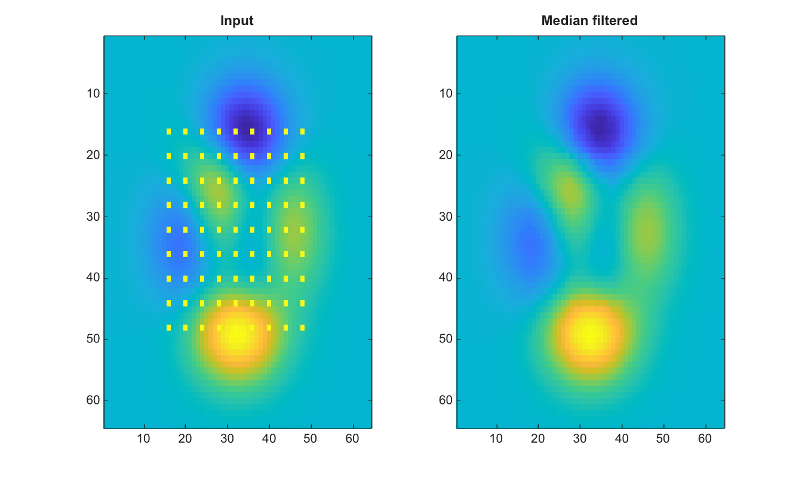

# medfilt2

Applique un filtrage median 2D.

## 📝 Syntaxe

- B = medfilt2(A)
- B = medfilt2(A, [m n])
- B = medfilt2(A, [m n], padopt)

## 📥 Argument d'entrée

- A - Image 2-D numerique ou logique.
- [m n] - Scalaire entier positif ou taille de voisinage a deux elements. La valeur par defaut est [3 3].
- padopt - Option de padding : zeros, indexed, symmetric ou replicate.

## 📤 Argument de sortie

- B - Image filtree par mediane, avec preservation de la classe d'entree.

## 📄 Description


Applique un filtrage median 2D. Le padding par defaut utilise des zeros. Les options de padding incluent zeros, indexed, symmetric et replicate. Les options textuelles sont insensibles a la casse.

## 💡 Exemple

Appliquer un filtrage median

```matlab
I=peaks(64);
I(16:4:48,16:4:48)=8;
J=medfilt2(I,[3 3]);
figure; subplot(1,2,1); imagesc(I); title('Input');
subplot(1,2,2); imagesc(J); title('Median filtered');
```



## 🔗 Voir aussi

[imfilter](../../../image_processing/1_image_basics/3_filtering_edges/imfilter.md), [imgaussfilt](../../../image_processing/1_image_basics/3_filtering_edges/imgaussfilt.md).

## 🕔 Historique

| Version | 📄 Description     |
| ------- | --------------- |
| 2.0.0   | version initiale |

<!--
## 👤 Auteur

Allan CORNET
-->
