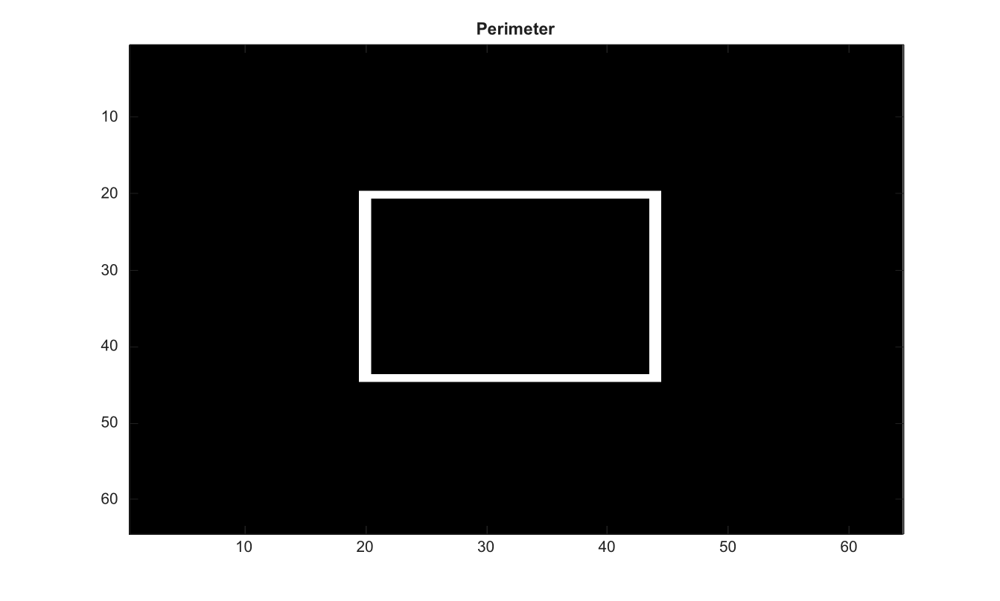

# bwperim

Trouve les pixels de perimetre des objets binaires.

## 📝 Syntaxe

- BW2 = bwperim(BW)
- BW2 = bwperim(BW, conn)

## 📥 Argument d'entrée

- BW - Image binaire d'entree. Les valeurs non nulles sont traitees comme true.
- conn - Connectivite, 4 ou 8.

## 📤 Argument de sortie

- BW2 - Image logique contenant les pixels de perimetre.

## 📄 Description


Trouve les pixels de perimetre des objets binaires. Les connectivites prises en charge sont 4 et 8.

## 💡 Exemple

Trouver le perimetre d un objet

```matlab
BW=false(64,64); BW(20:44,20:44)=true;
P=bwperim(BW);
figure; imagesc(P); g=linspace(0,1,64)'; colormap([g g g]); title('Perimeter');
```



## 🔗 Voir aussi

[bwmorph](../../../image_processing/2_image_analysis/4_morphology/bwmorph.md), [bwboundaries](../../../image_processing/2_image_analysis/5_regions_boundaries/bwboundaries.md).

## 🕔 Historique

| Version | 📄 Description     |
| ------- | --------------- |
| 2.0.0   | version initiale |

<!--
## 👤 Auteur

Allan CORNET
-->
