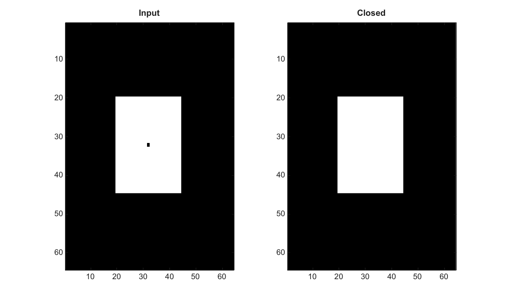

# imclose

Ferme une image par dilatation puis erosion.

## 📝 Syntaxe

- J = imclose(I, SE)

## 📥 Argument d'entrée

- I - Image binaire ou en niveaux de gris d'entree.
- SE - Structure d'element structurant ou voisinage logique.

## 📤 Argument de sortie

- J - Image fermee.

## 📄 Description


Ferme une image par dilatation puis erosion.

## 💡 Exemple

Fermer une image binaire

```matlab
BW=false(64,64); BW(20:44,20:44)=true; BW(32,32)=false;
J=imclose(BW,strel('disk',3));
figure; subplot(1,2,1); imagesc(BW); g=linspace(0,1,64)'; colormap([g g g]); title('Input');
subplot(1,2,2); imagesc(J); g=linspace(0,1,64)'; colormap([g g g]); title('Closed');
```



## 🔗 Voir aussi

[imopen](../../../image_processing/2_image_analysis/4_morphology/imopen.md), [imdilate](../../../image_processing/2_image_analysis/4_morphology/imdilate.md), [imerode](../../../image_processing/2_image_analysis/4_morphology/imerode.md).

## 🕔 Historique

| Version | 📄 Description     |
| ------- | --------------- |
| 2.0.0   | version initiale |

<!--
## 👤 Auteur

Allan CORNET
-->
