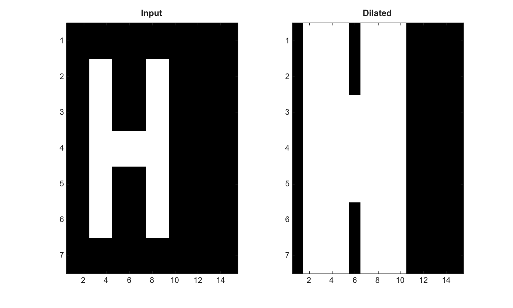

# imdilate

Dilate une image ou un volume binaire ou en niveaux de gris.

## 📝 Syntaxe

- J = imdilate(I, SE)

## 📥 Argument d'entrée

- I - Image binaire ou en niveaux de gris d'entree, ou volume 3-D.
- SE - Structure d'element structurant ou voisinage logique.

## 📤 Argument de sortie

- J - Image ou volume dilate.

## 📄 Description


Dilate une image binaire ou en niveaux de gris. Avec un element structurant 3-D, imdilate dilate un volume 3-D.

## 💡 Exemple

Dilater une image binaire de type texte

```matlab
BW=false(7,15); BW(2:6,3:4)=true; BW(2:6,8:9)=true; BW(4,5:7)=true;
J=imdilate(BW,strel('square',3));
figure; subplot(1,2,1); imagesc(BW); g=linspace(0,1,64)'; colormap([g g g]); title('Input');
subplot(1,2,2); imagesc(J); g=linspace(0,1,64)'; colormap([g g g]); title('Dilated');
```



## 🔗 Voir aussi

[imerode](../../../image_processing/2_image_analysis/4_morphology/imerode.md), [imclose](../../../image_processing/2_image_analysis/4_morphology/imclose.md), [imopen](../../../image_processing/2_image_analysis/4_morphology/imopen.md), [strel](../../../image_processing/2_image_analysis/4_morphology/strel.md).

## 🕔 Historique

| Version | 📄 Description     |
| ------- | --------------- |
| 2.0.0   | version initiale |

<!--
## 👤 Auteur

Allan CORNET
-->
