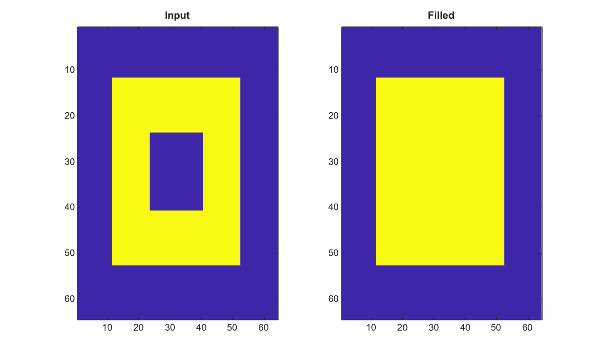

# imfill

Remplit les trous dans les images binaires.

## 📝 Syntaxe

- BW2 = imfill(BW)
- BW2 = imfill(BW, 'holes')
- BW2 = imfill(BW, conn, 'holes')

## 📥 Argument d'entrée

- BW - Image binaire d'entree. Les valeurs non nulles sont traitees comme true.
- conn - Connectivite, 4 ou 8.
- 'holes' - Remplit les trous dans les objets de premier plan.

## 📤 Argument de sortie

- BW2 - Image logique avec trous remplis.

## 📄 Description


Remplit les trous dans une image binaire 2-D. Les connectivites prises en charge sont 4 et 8.

## 💡 Exemple

Remplir un trou dans un objet binaire

```matlab
BW=false(64,64); BW(12:52,12:52)=true; BW(24:40,24:40)=false;
BW2=imfill(BW,'holes');
figure; subplot(1,2,1); imagesc(BW); title('Input');
subplot(1,2,2); imagesc(BW2); title('Filled');
```



## 🔗 Voir aussi

[imclose](../../../image_processing/2_image_analysis/4_morphology/imclose.md), [imreconstruct](../../../image_processing/2_image_analysis/7_segmentation/imreconstruct.md), [imclearborder](../../../image_processing/2_image_analysis/4_morphology/imclearborder.md).

## 🕔 Historique

| Version | 📄 Description     |
| ------- | --------------- |
| 2.0.0   | version initiale |

<!--
## 👤 Auteur

Allan CORNET
-->
