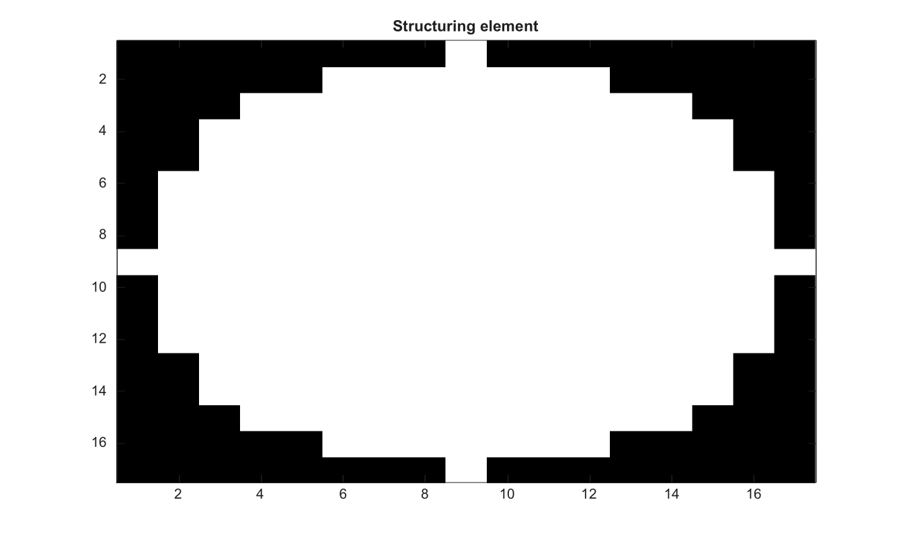

# strel

Cree un element structurant.

## 📝 Syntaxe

- SE = strel(nhood)
- SE = strel('arbitrary', nhood)
- SE = strel(shape, size)
- SE = strel('disk', radius, n)
- SE = strel('diamond', radius)
- SE = strel('octagon', radius)
- SE = strel('line', len, deg)
- SE = strel('cube', n)
- SE = strel('cuboid', [m n p])
- SE = strel('sphere', radius)

## 📥 Argument d'entrée

- nhood - Voisinage logique pour un element structurant arbitraire.
- shape - Nom de forme : 'arbitrary', 'square', 'rectangle', 'line', 'disk', 'diamond', 'octagon', 'cube', 'cuboid' ou 'sphere'.
- size - Scalaire positif ou vecteur de taille utilise par les formes square, rectangle, cube ou cuboid.
- radius - Rayon entier non negatif utilise par les formes disk, diamond, octagon et sphere.
- len - Longueur entiere positive utilisee par la forme line.
- deg - Angle de ligne en degres.
- n - Nombre optionnel de decomposition du disque, accepte comme 0, 4, 6 ou 8.

## 📤 Argument de sortie

- SE - Structure d'element structurant avec les champs type et nhood.

## 📄 Description


Cree un element structurant plat. Les formes 2-D prises en charge incluent arbitrary, square, rectangle, line, disk, diamond et octagon. Les formes 3-D prises en charge incluent arbitrary, cube, cuboid et sphere. L argument optionnel n de disk peut valoir 0, 4, 6 ou 8; Nelson renvoie actuellement le voisinage disk exact. Le rayon octagon doit etre un multiple non negatif de 3.

## 💡 Exemples

Afficher un element structurant

```matlab
SE=strel('disk',8);
figure; imagesc(SE.nhood); g=linspace(0,1,64)'; colormap([g g g]); title('Structuring element');
```

Creer des voisinages diamond et arbitraire

```matlab
D = strel('diamond', 1);
A = strel([0 1 0; 1 1 1; 0 1 0])
```
Creer un voisinage sphere 3-D

```matlab
SE = strel('sphere', 1);
sum(SE.nhood(:))
```


## 🔗 Voir aussi

[imdilate](../../../image_processing/2_image_analysis/4_morphology/imdilate.md), [imerode](../../../image_processing/2_image_analysis/4_morphology/imerode.md), [imopen](../../../image_processing/2_image_analysis/4_morphology/imopen.md), [imclose](../../../image_processing/2_image_analysis/4_morphology/imclose.md).

## 🕔 Historique

| Version | 📄 Description     |
| ------- | --------------- |
| 2.0.0   | version initiale |

<!--
## 👤 Auteur

Allan CORNET
-->
