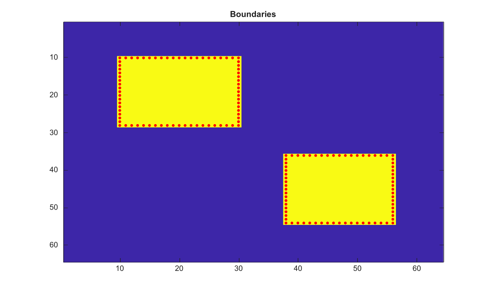

# bwboundaries

Trouve les pixels de frontiere des regions binaires.

## 📝 Syntaxe

- B = bwboundaries(BW)
- B = bwboundaries(BW, conn)
- [B, L, n] = bwboundaries(BW, conn, option)

## 📥 Argument d'entrée

- BW - Image binaire d'entree. Les valeurs non nulles sont traitees comme true.
- conn - Connectivite, 4 ou 8.
- option - Option de frontiere : 'holes' ou 'noholes'.

## 📤 Argument de sortie

- B - Cell array de matrices de coordonnees de frontiere.
- L - Matrice d'etiquettes pour les composantes de premier plan.
- n - Nombre de composantes de premier plan.

## 📄 Description


Trouve les coordonnees de perimetre des regions binaires connexes. Les connectivites prises en charge sont 4 et 8. L option 'holes' ajoute les frontieres des trous remplis.

## 💡 Exemple

Afficher les frontieres de regions binaires

```matlab
BW=false(64,64); BW(10:28,10:30)=true; BW(36:54,38:56)=true;
B=bwboundaries(BW);
figure; imagesc(BW); hold on;
for k=1:length(B), plot(B{k}(:,2), B{k}(:,1), 'r.'); end
title('Boundaries');
```



## 🔗 Voir aussi

[bwtraceboundary](../../../image_processing/2_image_analysis/5_regions_boundaries/bwtraceboundary.md), [bwperim](../../../image_processing/2_image_analysis/4_morphology/bwperim.md), [bwlabel](../../../image_processing/2_image_analysis/5_regions_boundaries/bwlabel.md).

## 🕔 Historique

| Version | 📄 Description     |
| ------- | --------------- |
| 2.0.0   | version initiale |

<!--
## 👤 Auteur

Allan CORNET
-->
