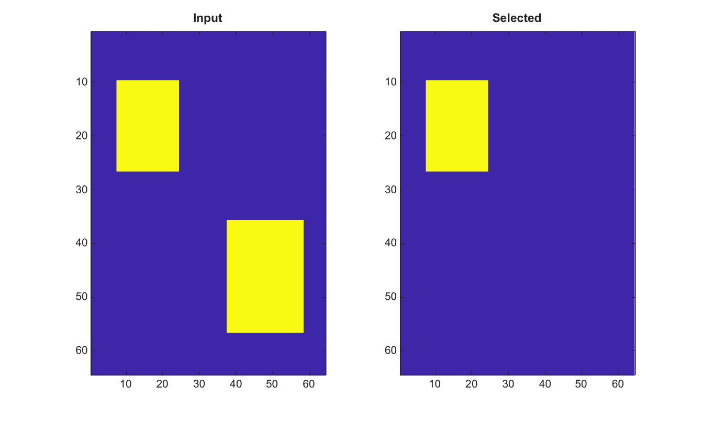

# bwselect

Selectionne des objets binaires connexes.

## 📝 Syntaxe

- BW2 = bwselect(BW, c, r)
- BW2 = bwselect(BW, c, r, conn)
- [BW2, idx] = bwselect(BW, c, r, conn)

## 📥 Argument d'entrée

- BW - Image binaire d'entree. Les valeurs non nulles sont traitees comme true.
- c - Coordonnees de colonnes des points de requete.
- r - Coordonnees de lignes des points de requete.
- conn - Connectivite, 4 ou 8.

## 📤 Argument de sortie

- BW2 - Image logique contenant les composantes connexes selectionnees.
- idx - Indices lineaires des pixels true dans BW2.

## 📄 Description

Selectionne les composantes connexes d une image binaire 2-D qui contiennent au moins un point de requete. Les coordonnees sont passees sous forme de colonnes c et lignes r. Les connectivites prises en charge sont 4 et 8.

## 💡 Exemple

Selectionner un objet dans une image binaire

```matlab
BW=false(64,64); BW(10:26,8:24)=true; BW(36:56,38:58)=true;
BW2=bwselect(BW, 16, 18, 8);
figure; subplot(1,2,1); imagesc(BW); title('Input');
subplot(1,2,2); imagesc(BW2); title('Selected');
```



## 🔗 Voir aussi

[bwlabel](../../../image_processing/bwlabel.md), [bwconncomp](../../../image_processing/bwconncomp.md).

## 🕔 Historique

| Version | 📄 Description   |
| ------- | ---------------- |
| 2.0.0   | version initiale |

<!--
## 👤 Auteur

Allan CORNET
-->
