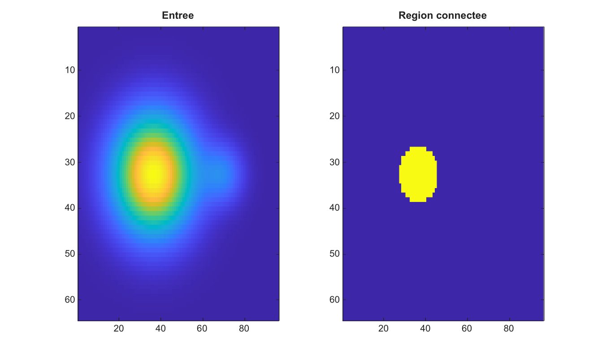

# grayconnected

Selectionne une region en niveaux de gris connectee depuis un pixel germe.

## 📝 Syntaxe

- BW = grayconnected(I, row, col)
- BW = grayconnected(I, row, col, tolerance)
- BW = grayconnected(I, row, col, tolerance, conn)

## 📥 Argument d'entrée

- I - Image 2-D numerique ou logique, reelle et finie.
- row - Indice de ligne du germe.
- col - Indice de colonne du germe.
- tolerance - Tolerance non negative en unites d'intensite normalisee. La valeur par defaut est 0.32.
- conn - Connectivite, soit 4, 8, ou une matrice 3-by-3 equivalente. La valeur par defaut est 8.

## 📤 Argument de sortie

- BW - Masque logique contenant les pixels connectes dont l'intensite reste dans la tolerance autour du germe.

## 📄 Description

grayconnected fait croitre une region connectee depuis un pixel germe. Un pixel est inclus lorsque son intensite normalisee differe de celle du germe d'au plus la tolerance et qu'il est connecte au germe par des pixels inclus.

Les entrees entieres et logiques sont converties en valeurs double precision normalisees pour la comparaison de tolerance. La sortie est toujours logique.

## 💡 Exemple

Faire croitre une region en niveaux de gris depuis un pixel germe

```matlab
[X,Y]=meshgrid(linspace(-1,1,96),linspace(-1,1,64));
I=0.2+0.6*exp(-6*((X+0.25).^2+Y.^2))+0.15*exp(-24*((X-0.45).^2+Y.^2));
BW=grayconnected(I,32,38,0.12,8);
figure; subplot(1,2,1); imagesc(I); title('Entree');
subplot(1,2,2); imagesc(BW); title('Region connectee');
```



## 🔗 Voir aussi

[bwselect](../../../image_processing/bwselect.md), [imregionalmin](../../../image_processing/imregionalmin.md), [watershed](../../../image_processing/watershed.md).

## 🕔 Historique

| Version | 📄 Description   |
| ------- | ---------------- |
| 2.0.0   | version initiale |

<!--
## 👤 Auteur

Allan CORNET
-->
