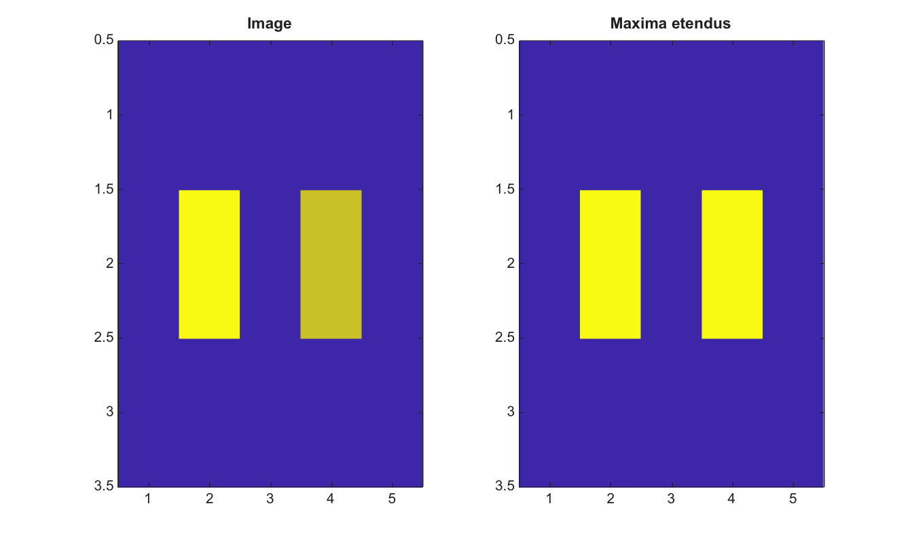

# imextendedmax

Trouve les maxima etendus dans une image 2-D.

## 📝 Syntaxe

- BW = imextendedmax(I, h)
- BW = imextendedmax(I, h, conn)

## 📥 Argument d'entrée

- I - Image 2-D reelle finie.
- h - Hauteur finie non negative pour la transformation h-maxima.
- conn - Connectivite, soit 4, 8, ou une matrice 3-by-3 equivalente.

## 📤 Argument de sortie

- BW - Masque logique des maxima regionaux apres suppression h-maxima.

## 📄 Description


imextendedmax applique imhmax puis trouve les maxima regionaux. Cette fonction aide a construire des masques de marqueurs qui ignorent les maxima moins profonds que h.

## 💡 Exemple

Trouver les maxima etendus

```matlab
I=[1 1 1 1 1;1 5 1 4 1;1 1 1 1 1];
BW=imextendedmax(I,2);
figure; subplot(1,2,1); imagesc(I); title('Image');
subplot(1,2,2); imagesc(BW); title('Maxima etendus');
```



## 🔗 Voir aussi

[imhmax](../../../image_processing/2_image_analysis/7_segmentation/imhmax.md), [imregionalmax](../../../image_processing/2_image_analysis/7_segmentation/imregionalmax.md), [imextendedmin](../../../image_processing/2_image_analysis/7_segmentation/imextendedmin.md).

## 🕔 Historique

| Version | 📄 Description     |
| ------- | --------------- |
| 2.0.0   | version initiale |

<!--
## 👤 Auteur

Allan CORNET
-->
