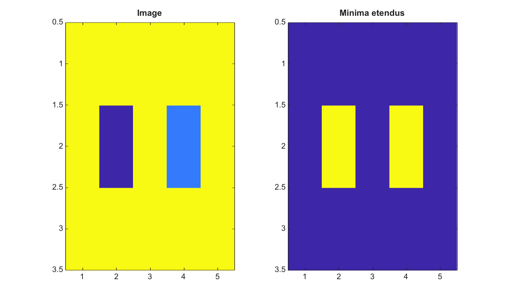

# imextendedmin

Trouve les minima etendus dans une image 2-D.

## 📝 Syntaxe

- BW = imextendedmin(I, h)
- BW = imextendedmin(I, h, conn)

## 📥 Argument d'entrée

- I - Image 2-D reelle finie.
- h - Hauteur finie non negative pour la transformation h-minima.
- conn - Connectivite, soit 4, 8, ou une matrice 3-by-3 equivalente.

## 📤 Argument de sortie

- BW - Masque logique des minima regionaux apres suppression h-minima.

## 📄 Description

imextendedmin applique imhmin puis trouve les minima regionaux. Cette fonction aide a construire des masques de marqueurs qui ignorent les minima moins profonds que h.

## 💡 Exemple

Trouver les minima etendus

```matlab
I=[5 5 5 5 5;5 1 5 2 5;5 5 5 5 5];
BW=imextendedmin(I,2);
figure; subplot(1,2,1); imagesc(I); title('Image');
subplot(1,2,2); imagesc(BW); title('Minima etendus');
```



## 🔗 Voir aussi

[imhmin](../../../image_processing/imhmin.md), [imregionalmin](../../../image_processing/imregionalmin.md), [imimposemin](../../../image_processing/imimposemin.md), [watershed](../../../image_processing/watershed.md).

## 🕔 Historique

| Version | 📄 Description   |
| ------- | ---------------- |
| 2.0.0   | version initiale |

<!--
## 👤 Auteur

Allan CORNET
-->
