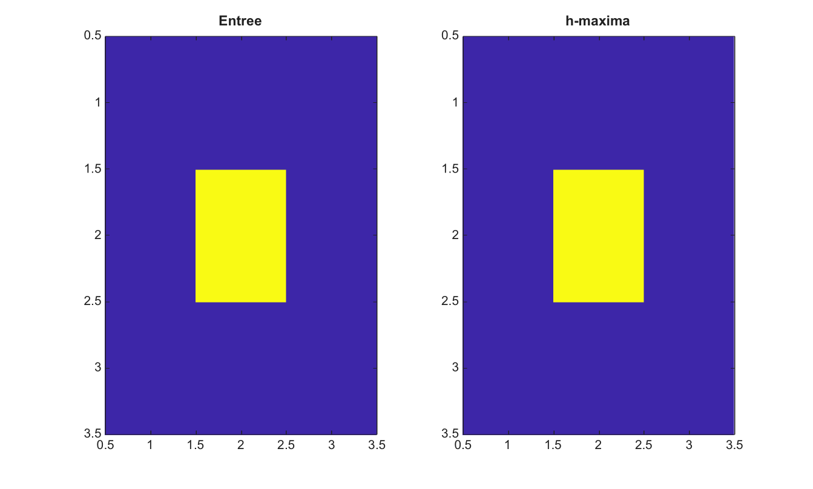

# imhmax

Supprime les maxima peu profonds avec la transformation h-maxima.

## 📝 Syntaxe

- J = imhmax(I, h)
- J = imhmax(I, h, conn)

## 📥 Argument d'entrée

- I - Image 2-D reelle finie.
- h - Hauteur finie non negative utilisee pour supprimer les maxima peu profonds.
- conn - Connectivite, soit 4, 8, ou une matrice 3-by-3 equivalente.

## 📤 Argument de sortie

- J - Image apres suppression h-maxima.

## 📄 Description

imhmax supprime les maxima moins profonds que h. Cette fonction aide a extraire des marqueurs de premier plan avant segmentation.

## 💡 Exemple

Supprimer un maximum peu profond

```matlab
I=[1 1 1;1 5 1;1 1 1];
J=imhmax(I,2);
figure; subplot(1,2,1); imagesc(I); title('Entree');
subplot(1,2,2); imagesc(J); title('h-maxima');
```



## 🔗 Voir aussi

[imextendedmax](../../../image_processing/imextendedmax.md), [imregionalmax](../../../image_processing/imregionalmax.md), [imhmin](../../../image_processing/imhmin.md).

## 🕔 Historique

| Version | 📄 Description   |
| ------- | ---------------- |
| 2.0.0   | version initiale |

<!--
## 👤 Auteur

Allan CORNET
-->
