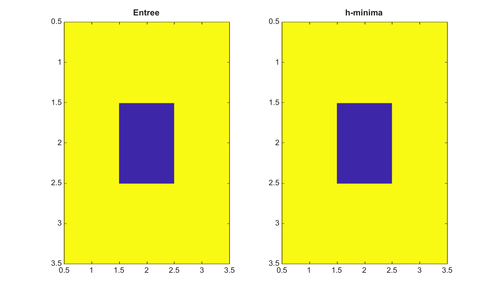

# imhmin

Supprime les minima peu profonds avec la transformation h-minima.

## 📝 Syntaxe

- J = imhmin(I, h)
- J = imhmin(I, h, conn)

## 📥 Argument d'entrée

- I - Image 2-D reelle finie.
- h - Hauteur finie non negative utilisee pour supprimer les minima peu profonds.
- conn - Connectivite, soit 4, 8, ou une matrice 3-by-3 equivalente.

## 📤 Argument de sortie

- J - Image apres suppression h-minima.

## 📄 Description

imhmin calcule la transformation h-minima par reconstruction en niveaux de gris par erosion de I+h sous I. Cette fonction aide a supprimer les minima peu profonds avant l'extraction de marqueurs ou une segmentation watershed.

## 💡 Exemple

Supprimer un minimum peu profond

```matlab
I=[5 5 5;5 2 5;5 5 5];
J=imhmin(I,2);
figure; subplot(1,2,1); imagesc(I); title('Entree');
subplot(1,2,2); imagesc(J); title('h-minima');
```



## 🔗 Voir aussi

[imextendedmin](../../../image_processing/imextendedmin.md), [imregionalmin](../../../image_processing/imregionalmin.md), [watershed](../../../image_processing/watershed.md).

## 🕔 Historique

| Version | 📄 Description   |
| ------- | ---------------- |
| 2.0.0   | version initiale |

<!--
## 👤 Auteur

Allan CORNET
-->
