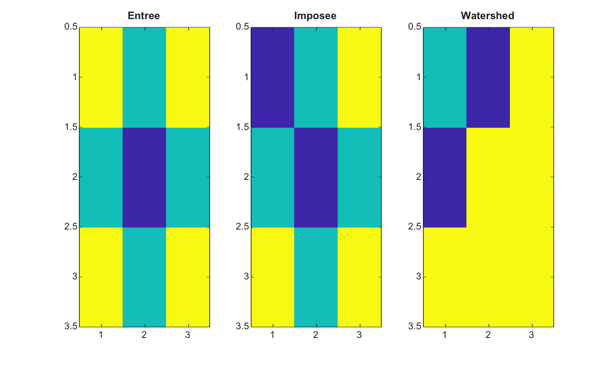

# imimposemin

Impose des minima regionaux aux pixels marqueurs.

## 📝 Syntaxe

- J = imimposemin(I, BW)
- J = imimposemin(I, BW, conn)

## 📥 Argument d'entrée

- I - Image 2-D reelle finie.
- BW - Masque binaire de marqueurs de meme taille que I.
- conn - Connectivite, soit 4, 8, ou une matrice 3-by-3 equivalente.

## 📤 Argument de sortie

- J - Image dont les pixels marqueurs sont forces a devenir des minima.

## 📄 Description

imimposemin modifie une image pour que les pixels marqueurs deviennent les minima les plus bas. Cette operation est utile avant watershed quand des marqueurs connus doivent initialiser les bassins.

## 💡 Exemple

Utiliser des marqueurs avant watershed

```matlab
I=[5 4 5;4 3 4;5 4 5];
markers=false(3,3); markers(1,1)=true;
J=imimposemin(I,markers);
L=watershed(J,4);
figure; subplot(1,3,1); imagesc(I); title('Entree');
subplot(1,3,2); imagesc(J); title('Imposee');
subplot(1,3,3); imagesc(L); title('Watershed');
```



## 🔗 Voir aussi

[imhmin](../../../image_processing/imhmin.md), [imextendedmin](../../../image_processing/imextendedmin.md), [imregionalmin](../../../image_processing/imregionalmin.md), [watershed](../../../image_processing/watershed.md), [activecontour](../../../image_processing/activecontour.md).

## 🕔 Historique

| Version | 📄 Description   |
| ------- | ---------------- |
| 2.0.0   | version initiale |

<!--
## 👤 Auteur

Allan CORNET
-->
