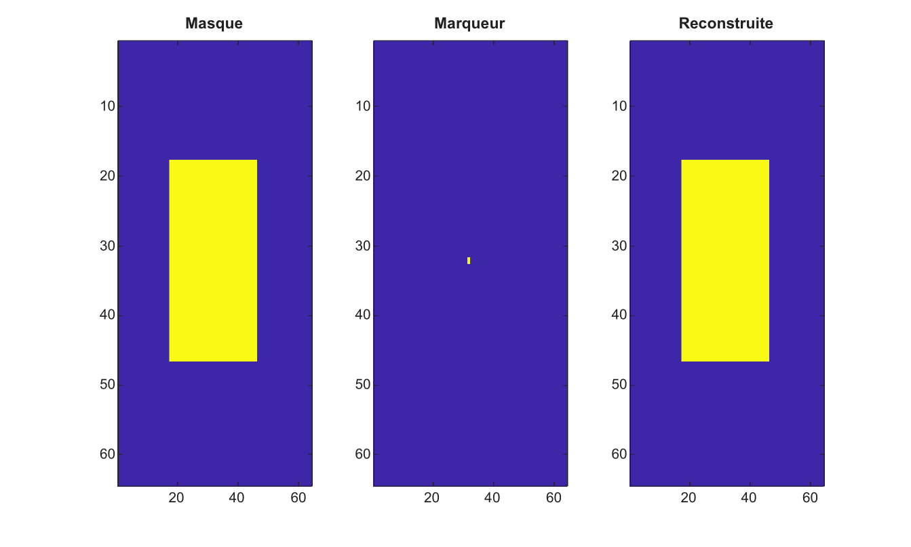

# imreconstruct

Effectue une reconstruction morphologique par dilatation.

## 📝 Syntaxe

- J = imreconstruct(marker, mask)
- J = imreconstruct(marker, mask, conn)

## 📥 Argument d'entrée

- marker - Image marqueur. Les valeurs doivent etre inferieures ou egales aux valeurs de mask.
- mask - Image masque de meme taille que marker.
- conn - Connectivite, soit 4, 8, ou une matrice 3-by-3 equivalente.

## 📤 Argument de sortie

- J - Image reconstruite, convertie comme mask.

## 📄 Description

imreconstruct dilate marker de facon repetee sous la contrainte de mask jusqu'a stabilite. La fonction prend en charge les images 2-D reelles finies en niveaux de gris ou binaires.

## 💡 Exemple

Reconstruire un composant binaire depuis un marqueur

```matlab
mask=false(64,64); mask(18:46,18:46)=true;
marker=false(64,64); marker(32,32)=true;
J=imreconstruct(marker,mask,4);
figure; subplot(1,3,1); imagesc(mask); title('Masque');
subplot(1,3,2); imagesc(marker); title('Marqueur');
subplot(1,3,3); imagesc(J); title('Reconstruite');
```



## 🔗 Voir aussi

[imhmin](../../../image_processing/imhmin.md), [imhmax](../../../image_processing/imhmax.md), [imregionalmin](../../../image_processing/imregionalmin.md), [watershed](../../../image_processing/watershed.md).

## 🕔 Historique

| Version | 📄 Description   |
| ------- | ---------------- |
| 2.0.0   | version initiale |

<!--
## 👤 Auteur

Allan CORNET
-->
