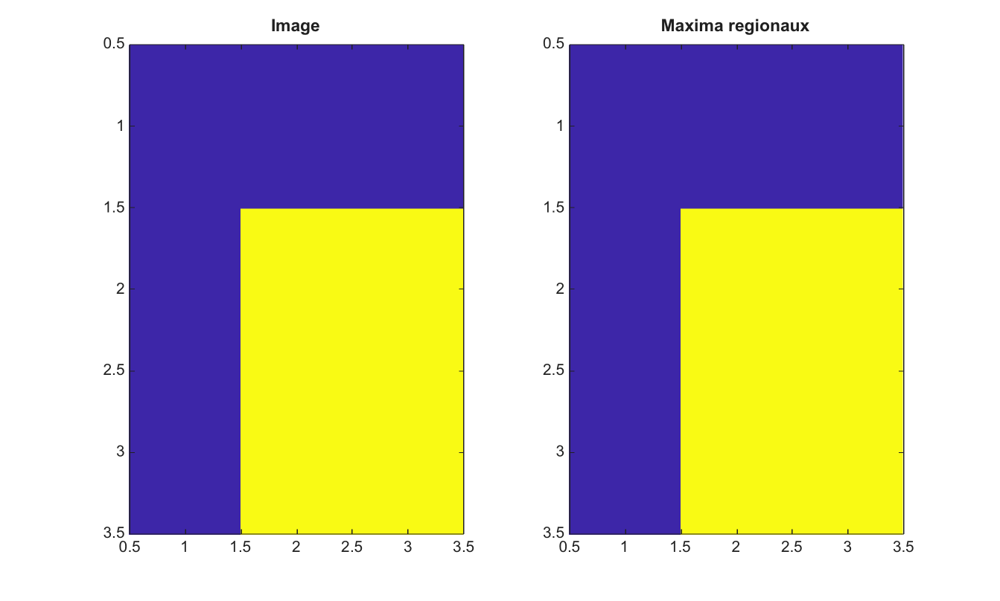

# imregionalmax

Trouve les maxima regionaux dans une image 2-D.

## 📝 Syntaxe

- BW = imregionalmax(I)
- BW = imregionalmax(I, conn)

## 📥 Argument d'entrée

- I - Image 2-D reelle finie.
- conn - Connectivite, soit 4, 8, ou une matrice 3-by-3 equivalente.

## 📤 Argument de sortie

- BW - Masque logique dont les pixels vrais appartiennent aux maxima regionaux.

## 📄 Description


imregionalmax marque les zones plates connectees qui n'ont aucun voisin de valeur plus elevee selon la connectivite choisie.

## 💡 Exemple

Trouver les maxima regionaux

```matlab
I=[1 1 1;1 3 3;1 3 3];
BW=imregionalmax(I);
figure; subplot(1,2,1); imagesc(I); title('Image');
subplot(1,2,2); imagesc(BW); title('Maxima regionaux');
```



## 🔗 Voir aussi

[imhmax](../../../image_processing/2_image_analysis/7_segmentation/imhmax.md), [imextendedmax](../../../image_processing/2_image_analysis/7_segmentation/imextendedmax.md), [imregionalmin](../../../image_processing/2_image_analysis/7_segmentation/imregionalmin.md).

## 🕔 Historique

| Version | 📄 Description     |
| ------- | --------------- |
| 2.0.0   | version initiale |

<!--
## 👤 Auteur

Allan CORNET
-->
