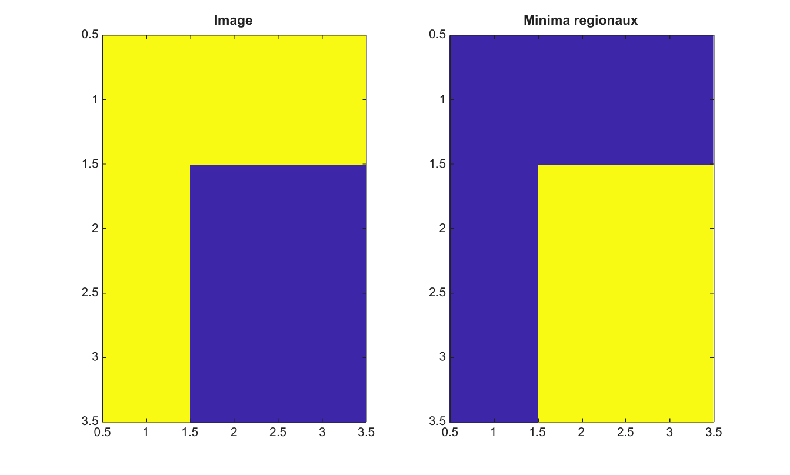

# imregionalmin

Trouve les minima regionaux dans une image 2-D.

## 📝 Syntaxe

- BW = imregionalmin(I)
- BW = imregionalmin(I, conn)

## 📥 Argument d'entrée

- I - Image 2-D reelle finie.
- conn - Connectivite, soit 4, 8, ou une matrice 3-by-3 equivalente.

## 📤 Argument de sortie

- BW - Masque logique dont les pixels vrais appartiennent aux minima regionaux.

## 📄 Description

imregionalmin marque les zones plates connectees qui n'ont aucun voisin de valeur plus basse selon la connectivite choisie. Cette fonction aide a inspecter les marqueurs naturels avant une segmentation watershed.

## 💡 Exemple

Trouver les minima regionaux

```matlab
I=[2 2 2;2 1 1;2 1 1];
BW=imregionalmin(I);
figure; subplot(1,2,1); imagesc(I); title('Image');
subplot(1,2,2); imagesc(BW); title('Minima regionaux');
```



## 🔗 Voir aussi

[imhmin](../../../image_processing/imhmin.md), [imextendedmin](../../../image_processing/imextendedmin.md), [imimposemin](../../../image_processing/imimposemin.md), [watershed](../../../image_processing/watershed.md).

## 🕔 Historique

| Version | 📄 Description   |
| ------- | ---------------- |
| 2.0.0   | version initiale |

<!--
## 👤 Auteur

Allan CORNET
-->
