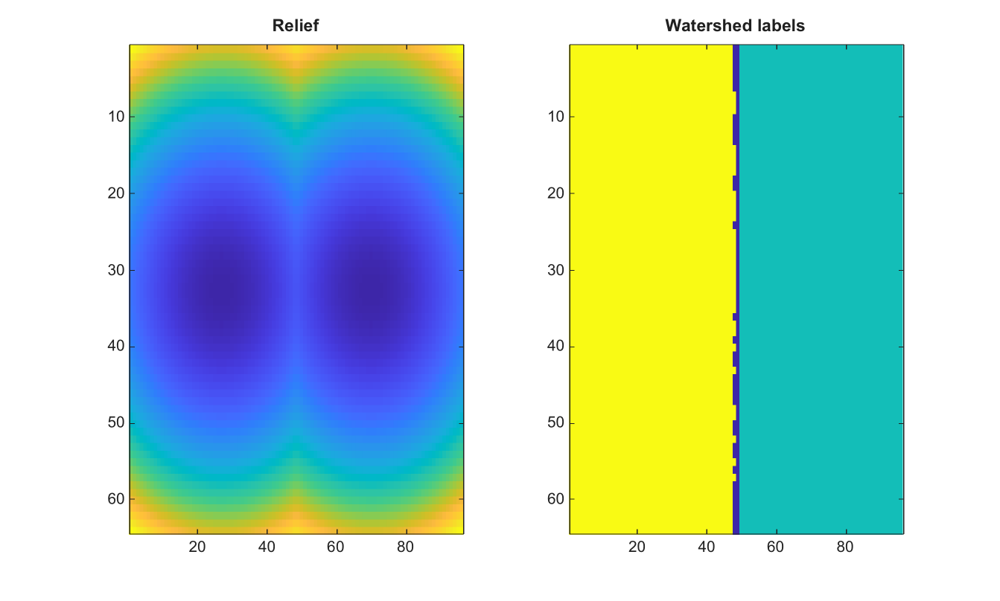

# watershed

Calcule les regions watershed d une image 2-D ou d un volume 3-D.

## 📝 Syntaxe

- L = watershed(I)
- L = watershed(I, conn)

## 📥 Argument d'entrée

- I - Image 2-D ou volume 3-D numerique ou logique, reel et fini.
- conn - Connectivite, 4 ou 8 pour les images, 6, 18 ou 26 pour les volumes. La valeur par defaut est 8 pour les images et 26 pour les volumes.

## 📤 Argument de sortie

- L - Tableau de labels double. Les elements de ligne de partage valent 0.

## 📄 Description


Calcule les regions watershed d une image 2-D ou d un volume 3-D reel fini. 

La connectivite peut etre 4, 8, ou une matrice 3-by-3 equivalente pour les images, et 6, 18, 26, ou un tableau 3-by-3-by-3 equivalent pour les volumes. 

Les labels identifient les bassins versants, et les elements de ligne de partage valent 0.

## 💡 Exemple

Segmenter une image de relief synthetique

```matlab
[X,Y]=meshgrid(linspace(-1,1,96),linspace(-1,1,64));
I=min((X+0.45).^2+Y.^2,(X-0.45).^2+Y.^2);
L=watershed(I,4);
figure; subplot(1,2,1); imagesc(I); title('Relief');
subplot(1,2,2); imagesc(L); title('Watershed labels');
```



## 🔗 Voir aussi

[imhmin](../../../image_processing/2_image_analysis/7_segmentation/imhmin.md), [imextendedmin](../../../image_processing/2_image_analysis/7_segmentation/imextendedmin.md), [imregionalmin](../../../image_processing/2_image_analysis/7_segmentation/imregionalmin.md), [imimposemin](../../../image_processing/2_image_analysis/7_segmentation/imimposemin.md), [activecontour](../../../image_processing/2_image_analysis/7_segmentation/activecontour.md).

## 🕔 Historique

| Version | 📄 Description     |
| ------- | --------------- |
| 2.0.0   | version initiale |

<!--
## 👤 Auteur

Allan CORNET
-->
