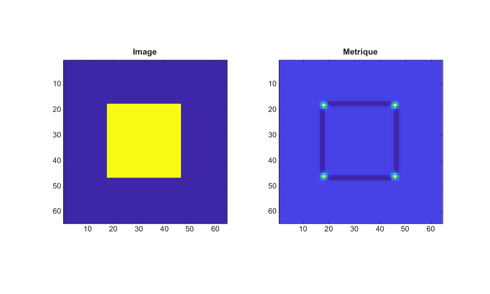

# cornermetric

Calcule une metrique de force de coin.

## 📝 Syntaxe

- C = cornermetric(I)
- C = cornermetric(I, method)
- C = cornermetric(..., Name, Value)

## 📥 Argument d'entrée

- I - Image d'entree en niveaux de gris ou RGB.
- method - Methode de metrique de coin : Harris ou Minimum Eigenvalue.

## 📤 Argument de sortie

- C - Image de metrique de coin.

## 📄 Description


cornermetric calcule une reponse de coins 2-D a partir des gradients d'image lisses par une fenetre gaussienne. Les options prises en charge sont FilterSize et SensitivityFactor.

## 💡 Exemple

Afficher une metrique de coins Harris

```matlab
I=zeros(64,64); I(18:46,18:46)=1;
C=cornermetric(I);
figure; subplot(1,2,1); imagesc(I); axis image; title('Image');
subplot(1,2,2); imagesc(C); axis image; title('Metrique');
```



## 🔗 Voir aussi

[detectHarrisFeatures](../../../image_processing/2_image_analysis/9_feature_detection/detectHarrisFeatures.md), [detectFASTFeatures](../../../image_processing/2_image_analysis/9_feature_detection/detectFASTFeatures.md).

## 🕔 Historique

| Version | 📄 Description     |
| ------- | --------------- |
| 2.0.0   | version initiale |

<!--
## 👤 Auteur

Allan CORNET
-->
