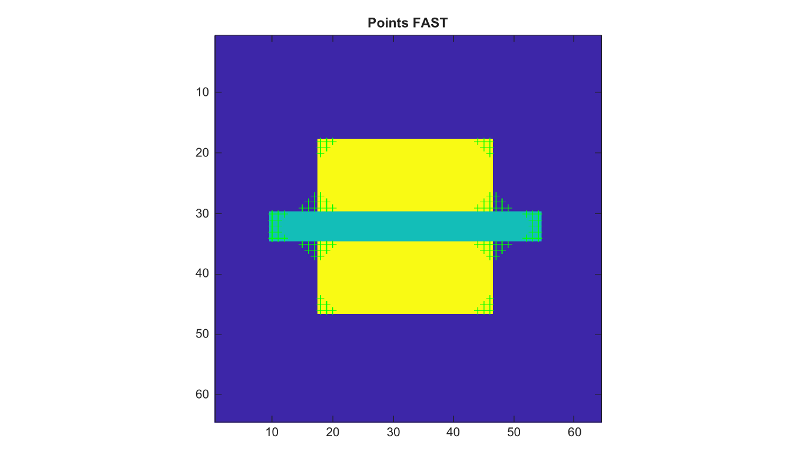

# detectFASTFeatures

Detecte les coins FAST.

## 📝 Syntaxe

- points = detectFASTFeatures(I)
- points = detectFASTFeatures(I, Name, Value)

## 📥 Argument d'entrée

- I - Image d'entree en niveaux de gris ou RGB.

## 📤 Argument de sortie

- points - Structure avec les champs Location, Metric et Count.

## 📄 Description


detectFASTFeatures applique un test circulaire de type FAST-9 et retourne les coordonnees des points locaux triees par force de contraste. Les options prises en charge sont MinContrast, MinQuality et ROI.

## 💡 Exemple

Detecter des points FAST

```matlab
I=zeros(64,64); I(18:46,18:46)=1; I(30:34,10:54)=0.5;
points=detectFASTFeatures(I,'MinContrast',0.2);
figure; imagesc(I); axis image; hold on;
plot(points.Location(:,1),points.Location(:,2),'g+'); title('Points FAST');
```



## 🔗 Voir aussi

[cornermetric](../../../image_processing/2_image_analysis/9_feature_detection/cornermetric.md), [detectHarrisFeatures](../../../image_processing/2_image_analysis/9_feature_detection/detectHarrisFeatures.md).

## 🕔 Historique

| Version | 📄 Description     |
| ------- | --------------- |
| 2.0.0   | version initiale |

<!--
## 👤 Auteur

Allan CORNET
-->
