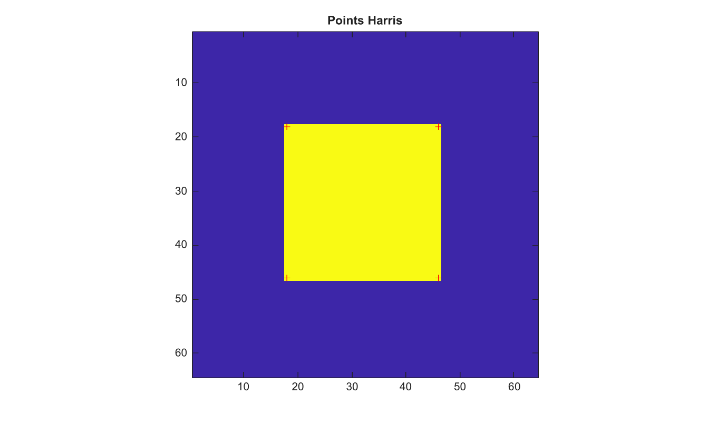

# detectHarrisFeatures

Detecte les coins de Harris.

## 📝 Syntaxe

- points = detectHarrisFeatures(I)
- points = detectHarrisFeatures(I, Name, Value)

## 📥 Argument d'entrée

- I - Image d'entree en niveaux de gris ou RGB.

## 📤 Argument de sortie

- points - Structure avec les champs Location, Metric et Count.

## 📄 Description


detectHarrisFeatures calcule une metrique de coins Harris, conserve les maxima locaux, les trie par force de metrique et retourne leurs coordonnees image. Les options prises en charge sont MinQuality, FilterSize, SensitivityFactor et ROI.

## 💡 Exemple

Detecter les coins dans une image carree

```matlab
I=zeros(64,64); I(18:46,18:46)=1;
points=detectHarrisFeatures(I,'MinQuality',0.05);
figure; imagesc(I); axis image; hold on;
plot(points.Location(:,1),points.Location(:,2),'r+'); title('Points Harris');
```



## 🔗 Voir aussi

[cornermetric](../../../image_processing/2_image_analysis/9_feature_detection/cornermetric.md), [detectFASTFeatures](../../../image_processing/2_image_analysis/9_feature_detection/detectFASTFeatures.md).

## 🕔 Historique

| Version | 📄 Description     |
| ------- | --------------- |
| 2.0.0   | version initiale |

<!--
## 👤 Auteur

Allan CORNET
-->
