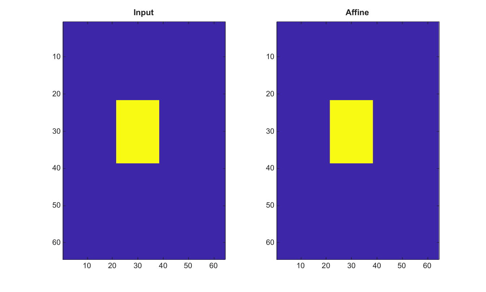

# affine2d

Cree une structure de transformation affine 2-D.

## 📝 Syntaxe

- tform = affine2d()
- tform = affine2d(T)

## 📥 Argument d'entrée

- T - Matrice affine 3-by-3 ou 2-by-3, finie et non singuliere, en convention vecteur ligne. La derniere colonne doit etre [0; 0; 1] apres expansion. Si elle est omise, la transformation identite est retournee.

## 📤 Argument de sortie

- tform - Structure avec les champs Type, Dimensionality et T, utilisable avec imwarp.

## 📄 Description

Cree une structure de transformation affine 2-D contenant une matrice T en convention vecteur ligne. La structure peut etre passee a imwarp.

## 💡 Exemple

Translate une image avec une transformation affine

```matlab
I=zeros(64,64); I(22:38,22:38)=1;
tform=affine2d([1 0 0;0 1 0;12 6 1]);
J=imwarp(I,tform,'Interpolation','nearest');
figure; subplot(1,2,1); imagesc(I); title('Input');
subplot(1,2,2); imagesc(J); title('Affine');
```



## 🔗 Voir aussi

[projective2d](../../../image_processing/projective2d.md), [affine3d](../../../image_processing/affine3d.md), [imwarp](../../../image_processing/imwarp.md), [fitgeotrans](../../../image_processing/fitgeotrans.md).

## 🕔 Historique

| Version | 📄 Description   |
| ------- | ---------------- |
| 2.0.0   | version initiale |

<!--
## 👤 Auteur

Allan CORNET
-->
