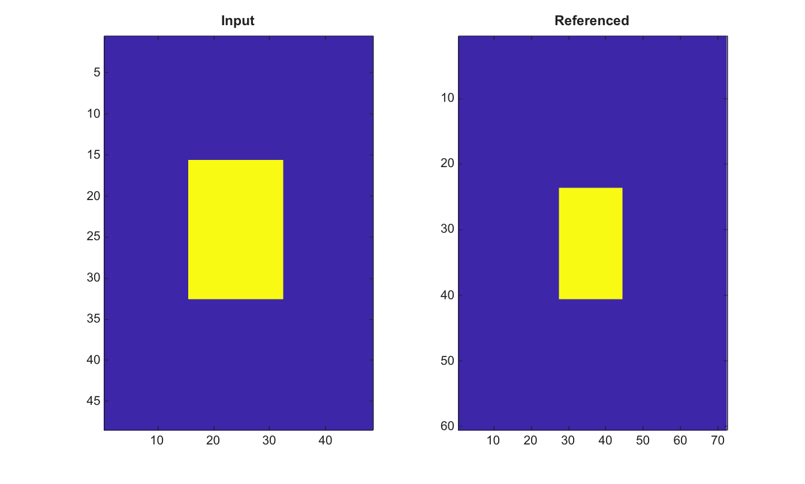

# imref2d

Cree une structure de reference spatiale 2-D.

## 📝 Syntaxe

- R = imref2d()
- R = imref2d(imageSize)
- R = imref2d(imageSize, pixelExtentInWorldX, pixelExtentInWorldY)
- R = imref2d(imageSize, xWorldLimits, yWorldLimits)

## 📥 Argument d'entrée

- imageSize - Vecteur d'entiers positifs qui definit la taille de l'image en lignes et colonnes.
- pixelExtentInWorldX, pixelExtentInWorldY - Pas de pixel scalaires positifs et finis en coordonnees monde.
- xWorldLimits - Deux valeurs finies croissantes qui definissent les limites monde selon les colonnes.
- yWorldLimits - Deux valeurs finies croissantes qui definissent les limites monde selon les lignes.

## 📤 Argument de sortie

- R - Structure de reference spatiale 2-D avec taille d'image, limites intrinseques, limites monde, etendues monde et pas de pixel.

## 📄 Description


Cree une structure de reference spatiale 2-D avec taille d image, limites monde, limites intrinseques, etendues monde et pas de pixel. La structure peut etre utilisee comme valeur OutputView pour imwarp ou comme reference source dans imwarp.

## 💡 Exemples

Transformer une image dans une vue referencee plus grande

```matlab
I=zeros(48,48); I(16:32,16:32)=1;
R=imref2d([60 72],[0.5 72.5],[0.5 60.5]);
J=imwarp(I,affine2d([1 0 0;0 1 0;12 8 1]),'nearest','OutputView',R);
figure; subplot(1,2,1); imagesc(I); title('Input');
subplot(1,2,2); imagesc(J); title('Referenced');
```

Creer une reference depuis les pas de pixel

```matlab
R = imref2d([2 3], 2, 3);
R.XWorldLimits
R.YWorldLimits
```


## 🔗 Voir aussi

[imref3d](../../../image_processing/3_geometry_registration_3d/6_geometric_transforms/imref3d.md), [imwarp](../../../image_processing/3_geometry_registration_3d/6_geometric_transforms/imwarp.md).

## 🕔 Historique

| Version | 📄 Description     |
| ------- | --------------- |
| 2.0.0   | version initiale |

<!--
## 👤 Auteur

Allan CORNET
-->
