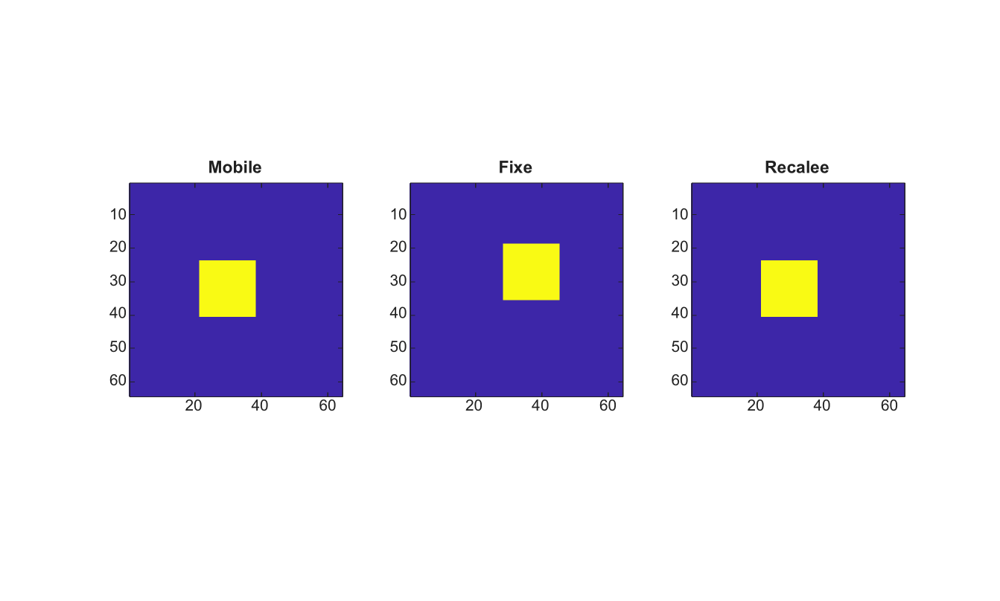

# imregcorr

Estime une transformation de recalage 2-D par correlation de phase.

## 📝 Syntaxe

- tform = imregcorr(moving, fixed)
- tform = imregcorr(moving, fixed, transformType)
- [tform, peakcorr] = imregcorr(...)

## 📥 Argument d'entrée

- moving - Image mobile en niveaux de gris ou RGB.
- fixed - Image fixe en niveaux de gris ou RGB, de meme taille que moving.
- transformType - Nom du type de transformation. Les valeurs prises en charge sont translation, rigid, similarity et affine. Cette premiere implementation estime la composante de translation.

## 📤 Argument de sortie

- tform - Structure de transformation affine 2-D qui aligne moving vers fixed.
- peakcorr - Valeur du pic de la surface de correlation de phase normalisee.

## 📄 Description

imregcorr estime la translation en pixels entiers entre deux images de meme taille avec une correlation de phase normalisee. Les entrees RGB sont converties en niveaux de gris avant le recalage. Le resultat est retourne sous forme de transformation affine2d.

## 💡 Exemple

Recaler une image translatee

```matlab
I=zeros(64,64); I(24:40,22:38)=1;
J=imtranslate(I,[7 -5],'nearest');
[tform,peakcorr]=imregcorr(I,J);
K=imwarp(I,tform,'nearest');
figure; subplot(1,3,1); imagesc(I); axis image; title('Mobile');
subplot(1,3,2); imagesc(J); axis image; title('Fixe');
subplot(1,3,3); imagesc(K); axis image; title('Recalee');
```



## 🔗 Voir aussi

[affine2d](../../../image_processing/affine2d.md), [imregconfig](../../../image_processing/imregconfig.md), [imregister](../../../image_processing/imregister.md), [imregtform](../../../image_processing/imregtform.md), [imtranslate](../../../image_processing/imtranslate.md), [imwarp](../../../image_processing/imwarp.md).

## 🕔 Historique

| Version | 📄 Description   |
| ------- | ---------------- |
| 2.0.0   | version initiale |

<!--
## 👤 Auteur

Allan CORNET
-->
