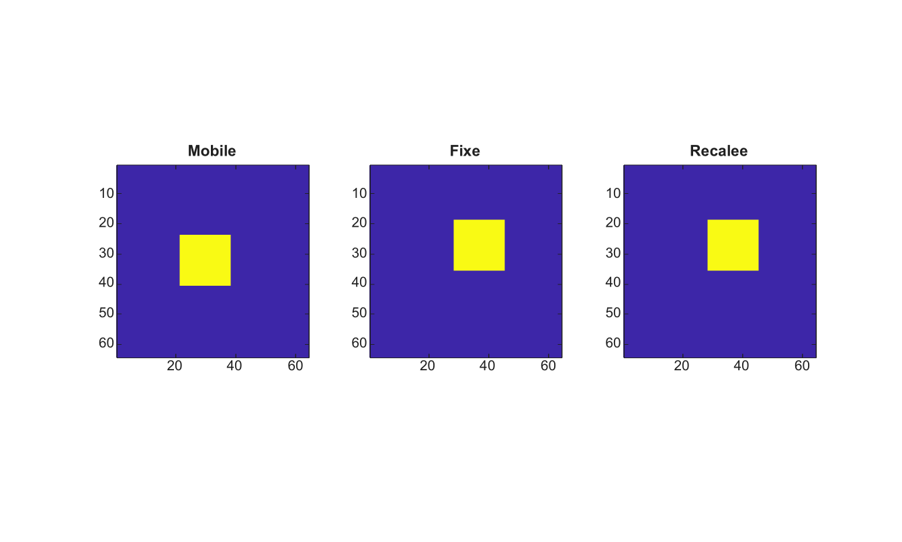

# imregister

Recale une image mobile sur une image fixe.

## 📝 Syntaxe

- registered = imregister(moving, fixed, transformType, optimizer, metric)
- registered = imregister(..., Name, Value)

## 📥 Argument d'entrée

- moving - Image mobile en niveaux de gris ou RGB.
- fixed - Image fixe en niveaux de gris ou RGB, de meme taille que moving.
- transformType - Type de transformation transmis a imregtform.
- optimizer - Structure d'optimiseur.
- metric - Structure de metrique ou nom de metrique.

## 📤 Argument de sortie

- registered - Image mobile recalee, echantillonnee sur la grille de l'image fixe.

## 📄 Description

imregister estime une transformation 2-D avec imregtform et reechantillonne l'image mobile sur la grille de l'image fixe avec imwarp. Les methodes d'interpolation prises en charge sont nearest, linear, bilinear et cubic.

## 💡 Exemple

Recaler une image translatee

```matlab
I=zeros(64,64); I(24:40,22:38)=1;
J=imtranslate(I,[7 -5],'nearest');
[optimizer,metric]=imregconfig('monomodal');
K=imregister(I,J,'translation',optimizer,metric,'Interpolation','nearest');
figure; subplot(1,3,1); imagesc(I); axis image; title('Mobile');
subplot(1,3,2); imagesc(J); axis image; title('Fixe');
subplot(1,3,3); imagesc(K); axis image; title('Recalee');
```



## 🔗 Voir aussi

[imregconfig](../../../image_processing/imregconfig.md), [imregcorr](../../../image_processing/imregcorr.md), [imregtform](../../../image_processing/imregtform.md), [imwarp](../../../image_processing/imwarp.md).

## 🕔 Historique

| Version | 📄 Description   |
| ------- | ---------------- |
| 2.0.0   | version initiale |

<!--
## 👤 Auteur

Allan CORNET
-->
