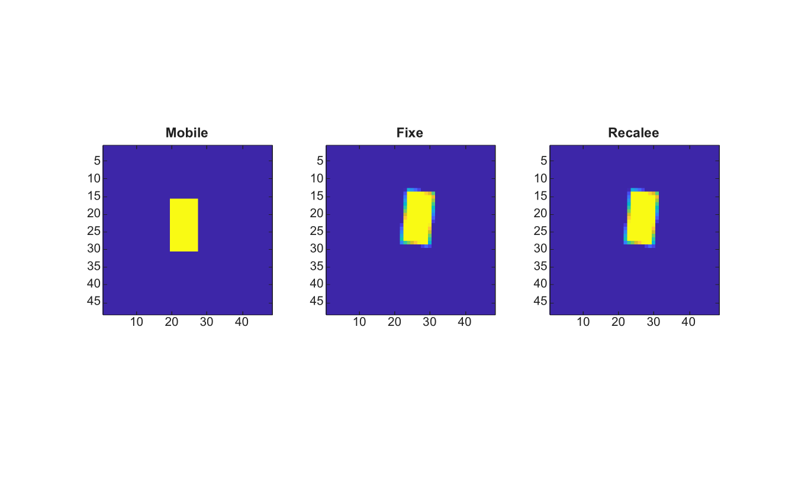

# imregtform

Estime une transformation de recalage 2-D a partir d'images.

## 📝 Syntaxe

- tform = imregtform(moving, fixed, transformType, optimizer, metric)
- tform = imregtform(..., Name, Value)

## 📥 Argument d'entrée

- moving - Image mobile en niveaux de gris ou RGB.
- fixed - Image fixe en niveaux de gris ou RGB, de meme taille que moving.
- transformType - Type de transformation : translation, rigid, similarity ou affine. Le mode affine estime translation, rotation, echelles X/Y independantes et cisaillement.
- optimizer - Structure d'optimiseur creee par imregconfig ou structure compatible.
- metric - Structure de metrique ou nom de metrique : MeanSquares ou Correlation.

## 📤 Argument de sortie

- tform - Structure de transformation affine 2-D qui aligne moving vers fixed.

## 📄 Description

imregtform estime une transformation de recalage 2-D simple sans dependance externe. La translation utilise une correlation de phase. Les modes rigid, similarity et affine utilisent une recherche deterministe en angle, echelle et cisaillement, notee avec la metrique choisie.

## 💡 Exemple

Estimer et appliquer un recalage rigide

```matlab
I=zeros(48,48); I(16:30,20:27)=1;
cx=24.5; cy=24.5; theta=6*pi/180; c=cos(theta); s=sin(theta);
T=[1 0 0;0 1 0;-cx -cy 1]*[c s 0;-s c 0;0 0 1]*[1 0 0;0 1 0;cx cy 1]*[1 0 0;0 1 0;3 -2 1];
J=imwarp(I,T,'linear','OutputView','same');
[optimizer,metric]=imregconfig('monomodal');
optimizer.AngleSearch=10;
tform=imregtform(I,J,'rigid',optimizer,metric);
K=imwarp(I,tform,'linear','OutputView','same');
figure; subplot(1,3,1); imagesc(I); axis image; title('Mobile');
subplot(1,3,2); imagesc(J); axis image; title('Fixe');
subplot(1,3,3); imagesc(K); axis image; title('Recalee');
```



## 🔗 Voir aussi

[imregconfig](../../../image_processing/imregconfig.md), [imregcorr](../../../image_processing/imregcorr.md), [imregister](../../../image_processing/imregister.md), [imwarp](../../../image_processing/imwarp.md).

## 🕔 Historique

| Version | 📄 Description   |
| ------- | ---------------- |
| 2.0.0   | version initiale |

<!--
## 👤 Auteur

Allan CORNET
-->
