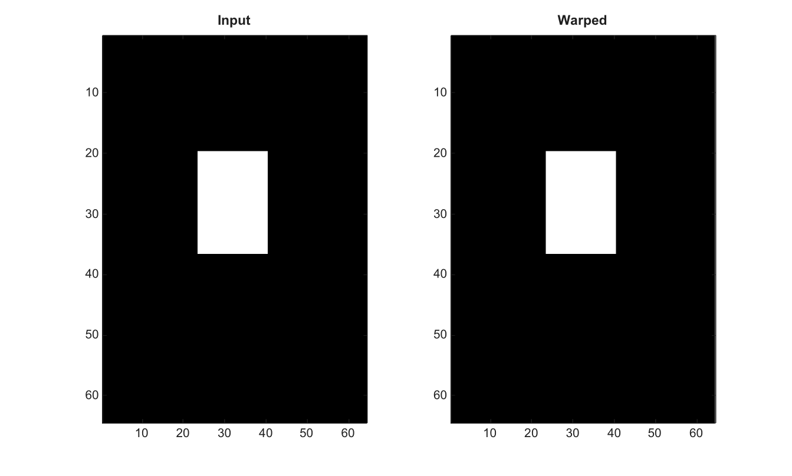

# imwarp

Transforme une image ou un volume avec une matrice numerique.

## 📝 Syntaxe

- J = imwarp(I, T)
- J = imwarp(I, RI, T)
- J = imwarp(V, RV, T)
- J = imwarp(I, T, method)
- J = imwarp(I, T, Name, Value)
- [J, R] = imwarp(...)

## 📥 Argument d'entrée

- I, V - Image 2-D en niveaux de gris, RGB, RGBA, ou volume 3-D.
- RI, RV - Reference spatiale source optionnelle, imref2d pour les images ou imref3d pour les volumes.
- T - Matrice de transformation numerique ou structure de transformation affine/projective.
- Name, Value - Les options prises en charge sont Interpolation, FillValues et OutputView.

## 📤 Argument de sortie

- J - Image ou volume transforme, avec preservation de la classe pour les classes image courantes.
- R - Reference spatiale de sortie.

## 📄 Description


Transforme une image avec une matrice projective 3-by-3, une matrice affine 2-by-3, ou une structure. 

Une structure imref2d peut etre fournie apres l image pour definir les coordonnees monde source. 

Les methodes d interpolation 2-D supportees sont nearest, linear, bilinear et cubic. 

OutputView peut etre un vecteur de taille, same, full, ou une structure imref2d. 

FillValues peut etre scalaire ou contenir une valeur par canal image, avec des valeurs numeriques ou logiques. 

Pour les volumes 3-D, imwarp accepte affine3d ou une matrice affine 4-by-4. 

Les appels 3-D supportent imref3d, l interpolation nearest ou linear, et des FillValues scalaires.

## 💡 Exemple

Transformer une image

```matlab
I=zeros(64,64); I(20:36,24:40)=1;
T=[1 0 0;0 1 0;10 6 1];
J=imwarp(I,T,'Interpolation','nearest');
figure; subplot(1,2,1); imagesc(I); g=linspace(0,1,64)'; colormap([g g g]); title('Input');
subplot(1,2,2); imagesc(J); g=linspace(0,1,64)'; colormap([g g g]); title('Warped');
```



## 🔗 Voir aussi

[imref3d](../../../image_processing/3_geometry_registration_3d/6_geometric_transforms/imref3d.md), [affine3d](../../../image_processing/3_geometry_registration_3d/6_geometric_transforms/affine3d.md).

## 🕔 Historique

| Version | 📄 Description     |
| ------- | --------------- |
| 2.0.0   | version initiale |

<!--
## 👤 Auteur

Allan CORNET
-->
