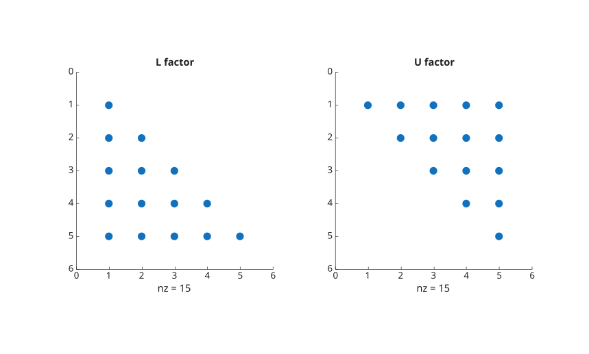

# lu

Factorisation LU d'une matrice.

## 📝 Syntaxe

- [L, U] = lu(A)
- [L, U, P] = lu(A)

## 📥 Argument d'entrée

- A - une matrice : carrée, finie (simple ou double précision).

## 📤 Argument de sortie

- L - Facteur triangulaire inférieur : matrice (même type que A)
- U - Facteur triangulaire supérieur : matrice (même type que A).
- P - Permutation de lignes : matrice (même type que A).

## 📄 Description


<b>[L, U] = lu(A)</b> décompose une matrice pleine <b>A</b> en deux matrices : une matrice triangulaire supérieure <b>U</b> et une matrice triangulaire inférieure permutée <b>L</b>. 

Cette factorisation satisfait l'équation <b>A = L \* U</b>. 

<b>[L, U, P] = lu(A)</b> : avec trois arguments de sortie, la fonction fournit une matrice de permutation<b>P</b> en plus de la matrice triangulaire inférieure unitaire <b>L</b> et de la matrice triangulaire supérieure <b>U</b>. 

Cette factorisation s'exprime comme <b>A = P'LU</b>, où<b>L</b> est triangulaire inférieure unitaire et<b>U</b> est triangulaire supérieure. 

Les matrices sparse single et sparse single complexes sont prises en charge. Les facteurs retournes conservent le stockage sparse et la precision de l'entree.

## Fonction(s) utilisée(s)

LAPACK dgetrf, LAPACK sgetrf, LAPACK zgetrf, LAPACK cgetrf

## 💡 Exemples


```matlab
A = magic(5)
[L, U] = lu(A)
L * U

```


```matlab
A = magic(5)
[L, U, P] = lu(A);
subplot(1, 2, 1)
spy(L)
title(_('L factor'))
subplot(1, 2, 2)
spy(U)
title(_('U factor'))

```

Factorisation LU sparse single.

```matlab
A = sparse(single([4 1; 2 3]));
[L, U, P] = lu(A)
```


## 🔗 Voir aussi

[cond](../../linear_algebra/5_matrix_properties/cond.md).

## 🕔 Historique

| Version | 📄 Description     |
| ------- | --------------- |
| 1.1.0   | version initiale |
| 2.0.0   | prise en charge des matrices sparse single et sparse single complexes. |

<!--
## 👤 Auteur

Allan CORNET
-->
