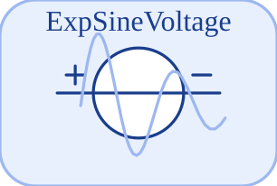

# ExpSineVoltage

<p align="center">

</p>
Source de tension sinusoidale amortie exponentiellement.

## 📝 Syntaxe

- Type de bloc : ExpSineVoltage

## 📥 Argument d'entrée

- broches physiques - 2 broche(s) physique(s) non orientee(s) ; 0 entree(s) de signal.

## 📤 Argument de sortie

- ports de signal - 0 sortie(s) de signal (lectures de capteur).

## 📄 Description

Composant acausal (Electrique (acausal)). Source de tension sinusoidale amortie exponentiellement.

| Champ        | Valeur                                                                                                                                                                                                                                                                                                              |
| ------------ | ------------------------------------------------------------------------------------------------------------------------------------------------------------------------------------------------------------------------------------------------------------------------------------------------------------------- |
| Module       | <code>nflow_blocks</code>                                                                                                                                                                                                                                                                                           |
| Bibliotheque | Electrique (acausal)                                                                                                                                                                                                                                                                                                |
| Type         | <code>ExpSineVoltage</code>                                                                                                                                                                                                                                                                                         |
| Libelle      | ExpSineVoltage                                                                                                                                                                                                                                                                                                      |
| Solveur      | Abaisse vers <code>physicalIsland</code>. Solveur de reference <code>dae</code> (differentiel-algebrique) ; la boucle a pas fixe et les solveurs explicites natifs (<code>ode1</code>/<code>ode4</code>/<code>ode45</code>) sont egalement pris en charge (un ilot multicorps articule necessite <code>dae</code>). |

<b>Sources d implementation</b>

<details>
<summary>Manifest: <code>modules/nflow_blocks/libraries/acausal_electrical/library.json</code></summary>

```json
{
  "id": "builtin.acausal_electrical",
  "title": "Electrical (acausal)",
  "version": "1.0.0",
  "format": "nflow-2",
  "metadata": {
    "author": "Allan CORNET",
    "tool": "Nelson nflow"
  },
  "comment": "Acausal electrical components (physical pins); lower to physicalIsland.",
  "license": "LGPL-3.0",
  "builtin": true,
  "renderModule": false,
  "blocks": [
    {
      "type": "Ground",
      "label": "Ground",
      "acausal": true,
      "domain": "electrical",
      "width": 100,
      "height": 80,
      "physicalPins": [
        {
          "name": "p",
          "x": 0,
          "y": 40,
          "side": "left",
          "domain": "electrical"
        }
      ],
      "inputs": [],
      "outputs": [],
      "defaultParams": {},
      "icon": "Ground.svg",
      "render": {
        "type": "image",
        "src": "Ground.svg"
      },
      "help": "Reference node (0 V) for an electrical island."
    },
    {
      "type": "Resistor",
      "label": "Resistor",
      "acausal": true,
      "domain": "electrical",
      "width": 100,
      "height": 80,
      "physicalPins": [
        {
          "name": "p",
          "x": 0,
          "y": 40,
          "side": "left",
          "domain": "electrical"
        },
        {
          "name": "n",
          "x": 100,
          "y": 40,
          "side": "right",
          "domain": "electrical"
        }
      ],
      "inputs": [],
      "outputs": [],
      "defaultParams": {
        "R": 1000
      },
      "icon": "Resistor.svg",
      "render": {
        "type": "image",
        "src": "Resistor.svg"
      },
      "help": "Ideal linear resistor: i = (v_p - v_n) / R."
    },
    {
      "type": "HeatingResistor",
      "label": "HeatingResistor",
      "acausal": true,
      "domain": "electrical",
      "width": 100,
      "height": 80,
      "physicalPins": [
        {
          "name": "p",
          "x": 0,
          "y": 40,
          "side": "left",
          "domain": "electrical"
        },
        {
          "name": "n",
          "x": 100,
          "y": 40,
          "side": "right",
          "domain": "electrical"
        },
        {
          "name": "heatPort",
          "x": 50,
          "y": 0,
          "side": "top",
          "domain": "thermal"
        }
      ],
      "inputs": [],
      "outputs": [],
      "defaultParams": {
        "R": 1000
      },
      "icon": "HeatingResistor.svg",
      "render": {
        "type": "image",
        "src": "HeatingResistor.svg"
      },
      "help": "Resistor that dissipates its power P = v^2 / R as heat into a thermal port."
    },
    {
      "type": "Conductor",
      "label": "Conductor",
      "acausal": true,
      "domain": "electrical",
      "width": 100,
      "height": 80,
      "physicalPins": [
        {
          "name": "p",
          "x": 0,
          "y": 40,
          "side": "left",
          "domain": "electrical"
        },
        {
          "name": "n",
          "x": 100,
          "y": 40,
          "side": "right",
          "domain": "electrical"
        }
      ],
      "inputs": [],
      "outputs": [],
      "defaultParams": {
        "G": 0.001
      },
      "icon": "Conductor.svg",
      "render": {
        "type": "image",
        "src": "Conductor.svg"
      },
      "help": "Ideal linear conductor: i = G (v_p - v_n)."
    },
    {
      "type": "VariableResistor",
      "label": "VariableResistor",
      "acausal": true,
      "domain": "electrical",
      "width": 100,
      "height": 80,
      "physicalPins": [
        {
          "name": "p",
          "x": 0,
          "y": 40,
          "side": "left",
          "domain": "electrical"
        },
        {
          "name": "n",
          "x": 100,
          "y": 40,
          "side": "right",
          "domain": "electrical"
        }
      ],
      "inputs": [
        {
          "x": 50,
          "y": 0,
          "side": "top",
          "name": "R"
        }
      ],
      "outputs": [],
      "defaultParams": {},
      "icon": "VariableResistor.svg",
      "render": {
        "type": "image",
        "src": "VariableResistor.svg"
      },
      "help": "Resistor whose resistance R is set by the input signal."
    },
    {
      "type": "VariableConductor",
      "label": "VariableConductor",
      "acausal": true,
      "domain": "electrical",
      "width": 100,
      "height": 80,
      "physicalPins": [
        {
          "name": "p",
          "x": 0,
          "y": 40,
          "side": "left",
          "domain": "electrical"
        },
        {
          "name": "n",
          "x": 100,
          "y": 40,
          "side": "right",
          "domain": "electrical"
        }
      ],
      "inputs": [
        {
          "x": 50,
          "y": 0,
          "side": "top",
          "name": "G"
        }
      ],
      "outputs": [],
      "defaultParams": {},
      "icon": "VariableConductor.svg",
      "render": {
        "type": "image",
        "src": "VariableConductor.svg"
      },
      "help": "Conductor whose conductance G is set by the input signal."
    },
    {
      "type": "VariableCapacitor",
      "label": "VariableCapacitor",
      "acausal": true,
      "domain": "electrical",
      "width": 100,
      "height": 80,
      "physicalPins": [
        {
          "name": "p",
          "x": 0,
          "y": 40,
          "side": "left",
          "domain": "electrical"
        },
        {
          "name": "n",
          "x": 100,
          "y": 40,
          "side": "right",
          "domain": "electrical"
        }
      ],
      "inputs": [
        {
          "x": 50,
          "y": 0,
          "side": "top",
          "name": "C"
        }
      ],
      "outputs": [],
      "defaultParams": {
        "q0": 0
      },
      "icon": "VariableCapacitor.svg",
      "render": {
        "type": "image",
        "src": "VariableCapacitor.svg"
      },
      "help": "Capacitor whose capacitance C is set by a signal (exact charge Q formulation)."
    },
    {
      "type": "VariableInductor",
      "label": "VariableInductor",
      "acausal": true,
      "domain": "electrical",
      "width": 100,
      "height": 80,
      "physicalPins": [
        {
          "name": "p",
          "x": 0,
          "y": 40,
          "side": "left",
          "domain": "electrical"
        },
        {
          "name": "n",
          "x": 100,
          "y": 40,
          "side": "right",
          "domain": "electrical"
        }
      ],
      "inputs": [
        {
          "x": 50,
          "y": 0,
          "side": "top",
          "name": "L"
        }
      ],
      "outputs": [],
      "defaultParams": {
        "phi0": 0
      },
      "icon": "VariableInductor.svg",
      "render": {
        "type": "image",
        "src": "VariableInductor.svg"
      },
      "help": "Inductor whose inductance L is set by a signal (exact flux phi formulation)."
    },
    {
      "type": "Capacitor",
      "label": "Capacitor",
      "acausal": true,
      "domain": "electrical",
      "width": 100,
      "height": 80,
      "physicalPins": [
        {
          "name": "p",
          "x": 0,
          "y": 40,
          "side": "left",
          "domain": "electrical"
        },
        {
          "name": "n",
          "x": 100,
          "y": 40,
          "side": "right",
          "domain": "electrical"
        }
      ],
      "inputs": [],
      "outputs": [],
      "defaultParams": {
        "C": 1e-6,
        "v0": 0
      },
      "icon": "Capacitor.svg",
      "render": {
        "type": "image",
        "src": "Capacitor.svg"
      },
      "help": "Ideal linear capacitor: i = C dv/dt."
    },
    {
      "type": "Inductor",
      "label": "Inductor",
      "acausal": true,
      "domain": "electrical",
      "width": 100,
      "height": 80,
      "physicalPins": [
        {
          "name": "p",
          "x": 0,
          "y": 40,
          "side": "left",
          "domain": "electrical"
        },
        {
          "name": "n",
          "x": 100,
          "y": 40,
          "side": "right",
          "domain": "electrical"
        }
      ],
      "inputs": [],
      "outputs": [],
      "defaultParams": {
        "L": 0.001,
        "i0": 0
      },
      "icon": "Inductor.svg",
      "render": {
        "type": "image",
        "src": "Inductor.svg"
      },
      "help": "Ideal linear inductor: v = L di/dt."
    },
    {
      "type": "ConstantVoltage",
      "label": "ConstantVoltage",
      "acausal": true,
      "domain": "electrical",
      "width": 100,
      "height": 80,
      "physicalPins": [
        {
          "name": "p",
          "x": 0,
          "y": 40,
          "side": "left",
          "domain": "electrical"
        },
        {
          "name": "n",
          "x": 100,
          "y": 40,
          "side": "right",
          "domain": "electrical"
        }
      ],
      "inputs": [],
      "outputs": [],
      "defaultParams": {
        "V": 1
      },
      "icon": "ConstantVoltage.svg",
      "render": {
        "type": "image",
        "src": "ConstantVoltage.svg"
      },
      "help": "Constant voltage source: v_p - v_n = V."
    },
    {
      "type": "SignalVoltage",
      "label": "SignalVoltage",
      "acausal": true,
      "domain": "electrical",
      "width": 100,
      "height": 80,
      "physicalPins": [
        {
          "name": "p",
          "x": 0,
          "y": 40,
          "side": "left",
          "domain": "electrical"
        },
        {
          "name": "n",
          "x": 100,
          "y": 40,
          "side": "right",
          "domain": "electrical"
        }
      ],
      "inputs": [
        {
          "x": 50,
          "y": 0,
          "side": "top",
          "name": "V"
        }
      ],
      "outputs": [],
      "defaultParams": {},
      "icon": "SignalVoltage.svg",
      "render": {
        "type": "image",
        "src": "SignalVoltage.svg"
      },
      "help": "Voltage source driven by the input signal."
    },
    {
      "type": "ConstantCurrent",
      "label": "ConstantCurrent",
      "acausal": true,
      "domain": "electrical",
      "width": 100,
      "height": 80,
      "physicalPins": [
        {
          "name": "p",
          "x": 0,
          "y": 40,
          "side": "left",
          "domain": "electrical"
        },
        {
          "name": "n",
          "x": 100,
          "y": 40,
          "side": "right",
          "domain": "electrical"
        }
      ],
      "inputs": [],
      "outputs": [],
      "defaultParams": {
        "I": 1
      },
      "icon": "ConstantCurrent.svg",
      "render": {
        "type": "image",
        "src": "ConstantCurrent.svg"
      },
      "help": "Constant current source: current I flows p -> n."
    },
    {
      "type": "SignalCurrent",
      "label": "SignalCurrent",
      "acausal": true,
      "domain": "electrical",
      "width": 100,
      "height": 80,
      "physicalPins": [
        {
          "name": "p",
          "x": 0,
          "y": 40,
          "side": "left",
          "domain": "electrical"
        },
        {
          "name": "n",
          "x": 100,
          "y": 40,
          "side": "right",
          "domain": "electrical"
        }
      ],
      "inputs": [
        {
          "x": 50,
          "y": 0,
          "side": "top",
          "name": "I"
        }
      ],
      "outputs": [],
      "defaultParams": {},
      "icon": "SignalCurrent.svg",
      "render": {
        "type": "image",
        "src": "SignalCurrent.svg"
      },
      "help": "Current source driven by the input signal."
    },
    {
      "type": "SineVoltage",
      "label": "SineVoltage",
      "acausal": true,
      "domain": "electrical",
      "width": 100,
      "height": 80,
      "physicalPins": [
        {
          "name": "p",
          "x": 0,
          "y": 40,
          "side": "left",
          "domain": "electrical"
        },
        {
          "name": "n",
          "x": 100,
          "y": 40,
          "side": "right",
          "domain": "electrical"
        }
      ],
      "inputs": [],
      "outputs": [],
      "defaultParams": {
        "Amplitude": 1,
        "Frequency": 1,
        "Phase": 0
      },
      "icon": "SineVoltage.svg",
      "render": {
        "type": "image",
        "src": "SineVoltage.svg"
      },
      "help": "Sine voltage source: v = Amplitude sin(2 pi Frequency t + Phase)."
    },
    {
      "type": "SineCurrent",
      "label": "SineCurrent",
      "acausal": true,
      "domain": "electrical",
      "width": 100,
      "height": 80,
      "physicalPins": [
        {
          "name": "p",
          "x": 0,
          "y": 40,
          "side": "left",
          "domain": "electrical"
        },
        {
          "name": "n",
          "x": 100,
          "y": 40,
          "side": "right",
          "domain": "electrical"
        }
      ],
      "inputs": [],
      "outputs": [],
      "defaultParams": {
        "Amplitude": 1,
        "Frequency": 1,
        "Phase": 0
      },
      "icon": "SineCurrent.svg",
      "render": {
        "type": "image",
        "src": "SineCurrent.svg"
      },
      "help": "Sine current source: i = Amplitude sin(2 pi Frequency t + Phase)."
    },
    {
      "type": "ExpSineVoltage",
      "label": "ExpSineVoltage",
      "acausal": true,
      "domain": "electrical",
      "width": 100,
      "height": 80,
      "physicalPins": [
        {
          "name": "p",
          "x": 0,
          "y": 40,
          "side": "left",
          "domain": "electrical"
        },
        {
          "name": "n",
          "x": 100,
          "y": 40,
          "side": "right",
          "domain": "electrical"
        }
      ],
      "inputs": [],
      "outputs": [],
      "defaultParams": {
        "Amplitude": 1,
        "Frequency": 2,
        "Damping": 0.5,
        "Phase": 0
      },
      "icon": "ExpSineVoltage.svg",
      "render": {
        "type": "image",
        "src": "ExpSineVoltage.svg"
      },
      "help": "Exponentially damped sine voltage source."
    },
    {
      "type": "ExpSineCurrent",
      "label": "ExpSineCurrent",
      "acausal": true,
      "domain": "electrical",
      "width": 100,
      "height": 80,
      "physicalPins": [
        {
          "name": "p",
          "x": 0,
          "y": 40,
          "side": "left",
          "domain": "electrical"
        },
        {
          "name": "n",
          "x": 100,
          "y": 40,
          "side": "right",
          "domain": "electrical"
        }
      ],
      "inputs": [],
      "outputs": [],
      "defaultParams": {
        "Amplitude": 1,
        "Frequency": 2,
        "Damping": 0.5,
        "Phase": 0
      },
      "icon": "ExpSineCurrent.svg",
      "render": {
        "type": "image",
        "src": "ExpSineCurrent.svg"
      },
      "help": "Exponentially damped sine current source."
    },
    {
      "type": "TrapezoidVoltage",
      "label": "TrapezoidVoltage",
      "acausal": true,
      "domain": "electrical",
      "width": 100,
      "height": 80,
      "physicalPins": [
        {
          "name": "p",
          "x": 0,
          "y": 40,
          "side": "left",
          "domain": "electrical"
        },
        {
          "name": "n",
          "x": 100,
          "y": 40,
          "side": "right",
          "domain": "electrical"
        }
      ],
      "inputs": [],
      "outputs": [],
      "defaultParams": {
        "Amplitude": 1,
        "Rising": 0.2,
        "Width": 0.3,
        "Falling": 0.2,
        "Period": 1
      },
      "icon": "TrapezoidVoltage.svg",
      "render": {
        "type": "image",
        "src": "TrapezoidVoltage.svg"
      },
      "help": "Trapezoidal voltage source (continuous ramp-up / hold / ramp-down)."
    },
    {
      "type": "TrapezoidCurrent",
      "label": "TrapezoidCurrent",
      "acausal": true,
      "domain": "electrical",
      "width": 100,
      "height": 80,
      "physicalPins": [
        {
          "name": "p",
          "x": 0,
          "y": 40,
          "side": "left",
          "domain": "electrical"
        },
        {
          "name": "n",
          "x": 100,
          "y": 40,
          "side": "right",
          "domain": "electrical"
        }
      ],
      "inputs": [],
      "outputs": [],
      "defaultParams": {
        "Amplitude": 1,
        "Rising": 0.2,
        "Width": 0.3,
        "Falling": 0.2,
        "Period": 1
      },
      "icon": "TrapezoidCurrent.svg",
      "render": {
        "type": "image",
        "src": "TrapezoidCurrent.svg"
      },
      "help": "Trapezoidal current source (continuous ramp-up / hold / ramp-down)."
    },
    {
      "type": "VCV",
      "label": "VCV",
      "acausal": true,
      "domain": "electrical",
      "width": 100,
      "height": 80,
      "physicalPins": [
        {
          "name": "p",
          "x": 0,
          "y": 40,
          "side": "left",
          "domain": "electrical"
        },
        {
          "name": "n",
          "x": 100,
          "y": 40,
          "side": "right",
          "domain": "electrical"
        },
        {
          "name": "cp",
          "x": 50,
          "y": 0,
          "side": "top",
          "domain": "electrical"
        },
        {
          "name": "cn",
          "x": 50,
          "y": 0,
          "side": "top",
          "domain": "electrical"
        }
      ],
      "inputs": [],
      "outputs": [],
      "defaultParams": {
        "gain": 1
      },
      "icon": "VCV.svg",
      "render": {
        "type": "image",
        "src": "VCV.svg"
      },
      "help": "Voltage-controlled voltage source: v_pn = gain (v_cp - v_cn)."
    },
    {
      "type": "VCC",
      "label": "VCC",
      "acausal": true,
      "domain": "electrical",
      "width": 100,
      "height": 80,
      "physicalPins": [
        {
          "name": "p",
          "x": 0,
          "y": 40,
          "side": "left",
          "domain": "electrical"
        },
        {
          "name": "n",
          "x": 100,
          "y": 40,
          "side": "right",
          "domain": "electrical"
        },
        {
          "name": "cp",
          "x": 50,
          "y": 0,
          "side": "top",
          "domain": "electrical"
        },
        {
          "name": "cn",
          "x": 50,
          "y": 0,
          "side": "top",
          "domain": "electrical"
        }
      ],
      "inputs": [],
      "outputs": [],
      "defaultParams": {
        "gain": 1
      },
      "icon": "VCC.svg",
      "render": {
        "type": "image",
        "src": "VCC.svg"
      },
      "help": "Voltage-controlled current source: i = gain (v_cp - v_cn)."
    },
    {
      "type": "CCV",
      "label": "CCV",
      "acausal": true,
      "domain": "electrical",
      "width": 100,
      "height": 80,
      "physicalPins": [
        {
          "name": "p",
          "x": 0,
          "y": 40,
          "side": "left",
          "domain": "electrical"
        },
        {
          "name": "n",
          "x": 100,
          "y": 40,
          "side": "right",
          "domain": "electrical"
        },
        {
          "name": "cp",
          "x": 50,
          "y": 0,
          "side": "top",
          "domain": "electrical"
        },
        {
          "name": "cn",
          "x": 50,
          "y": 0,
          "side": "top",
          "domain": "electrical"
        }
      ],
      "inputs": [],
      "outputs": [],
      "defaultParams": {
        "gain": 1
      },
      "icon": "CCV.svg",
      "render": {
        "type": "image",
        "src": "CCV.svg"
      },
      "help": "Current-controlled voltage source: v_pn = gain i_cp (the sense branch cp-cn is a short)."
    },
    {
      "type": "CCC",
      "label": "CCC",
      "acausal": true,
      "domain": "electrical",
      "width": 100,
      "height": 80,
      "physicalPins": [
        {
          "name": "p",
          "x": 0,
          "y": 40,
          "side": "left",
          "domain": "electrical"
        },
        {
          "name": "n",
          "x": 100,
          "y": 40,
          "side": "right",
          "domain": "electrical"
        },
        {
          "name": "cp",
          "x": 50,
          "y": 0,
          "side": "top",
          "domain": "electrical"
        },
        {
          "name": "cn",
          "x": 50,
          "y": 0,
          "side": "top",
          "domain": "electrical"
        }
      ],
      "inputs": [],
      "outputs": [],
      "defaultParams": {
        "gain": 1
      },
      "icon": "CCC.svg",
      "render": {
        "type": "image",
        "src": "CCC.svg"
      },
      "help": "Current-controlled current source: i_pn = gain i_cp (the sense branch cp-cn is a short)."
    },
    {
      "type": "Diode",
      "label": "Diode",
      "acausal": true,
      "domain": "electrical",
      "width": 100,
      "height": 80,
      "physicalPins": [
        {
          "name": "p",
          "x": 0,
          "y": 40,
          "side": "left",
          "domain": "electrical"
        },
        {
          "name": "n",
          "x": 100,
          "y": 40,
          "side": "right",
          "domain": "electrical"
        }
      ],
      "inputs": [],
      "outputs": [],
      "defaultParams": {
        "Is": 1e-9,
        "Vt": 0.025
      },
      "icon": "Diode.svg",
      "render": {
        "type": "image",
        "src": "Diode.svg"
      },
      "help": "Exponential (Shockley) diode: i = Is (exp(vd/Vt) - 1)."
    },
    {
      "type": "ZDiode",
      "label": "ZDiode",
      "acausal": true,
      "domain": "electrical",
      "width": 100,
      "height": 80,
      "physicalPins": [
        {
          "name": "p",
          "x": 0,
          "y": 40,
          "side": "left",
          "domain": "electrical"
        },
        {
          "name": "n",
          "x": 100,
          "y": 40,
          "side": "right",
          "domain": "electrical"
        }
      ],
      "inputs": [],
      "outputs": [],
      "defaultParams": {
        "Is": 1e-9,
        "Vt": 0.04,
        "Vz": 5
      },
      "icon": "ZDiode.svg",
      "render": {
        "type": "image",
        "src": "ZDiode.svg"
      },
      "help": "Zener diode: forward Shockley conduction plus reverse breakdown at -Vz."
    },
    {
      "type": "IdealDiode",
      "label": "IdealDiode",
      "acausal": true,
      "domain": "electrical",
      "width": 100,
      "height": 80,
      "physicalPins": [
        {
          "name": "p",
          "x": 0,
          "y": 40,
          "side": "left",
          "domain": "electrical"
        },
        {
          "name": "n",
          "x": 100,
          "y": 40,
          "side": "right",
          "domain": "electrical"
        }
      ],
      "inputs": [],
      "outputs": [],
      "defaultParams": {
        "Ron": 0.001,
        "Goff": 1e-6,
        "Vknee": 0
      },
      "icon": "IdealDiode.svg",
      "render": {
        "type": "image",
        "src": "IdealDiode.svg"
      },
      "help": "Ideal diode switching at the knee voltage Vknee: off below it (leak conductance Goff), on above it (on-resistance Ron in series with Vknee); the mode flip is an event."
    },
    {
      "type": "RampVoltage",
      "label": "RampVoltage",
      "acausal": true,
      "domain": "electrical",
      "width": 100,
      "height": 80,
      "physicalPins": [
        {
          "name": "p",
          "x": 0,
          "y": 40,
          "side": "left",
          "domain": "electrical"
        },
        {
          "name": "n",
          "x": 100,
          "y": 40,
          "side": "right",
          "domain": "electrical"
        }
      ],
      "inputs": [],
      "outputs": [],
      "defaultParams": {
        "Slope": 1,
        "StartTime": 0
      },
      "icon": "RampVoltage.svg",
      "render": {
        "type": "image",
        "src": "RampVoltage.svg"
      },
      "help": "Ramp voltage source: v = Slope (t - StartTime) for t >= StartTime, else 0."
    },
    {
      "type": "RampCurrent",
      "label": "RampCurrent",
      "acausal": true,
      "domain": "electrical",
      "width": 100,
      "height": 80,
      "physicalPins": [
        {
          "name": "p",
          "x": 0,
          "y": 40,
          "side": "left",
          "domain": "electrical"
        },
        {
          "name": "n",
          "x": 100,
          "y": 40,
          "side": "right",
          "domain": "electrical"
        }
      ],
      "inputs": [],
      "outputs": [],
      "defaultParams": {
        "Slope": 1,
        "StartTime": 0
      },
      "icon": "RampCurrent.svg",
      "render": {
        "type": "image",
        "src": "RampCurrent.svg"
      },
      "help": "Ramp current source: i = Slope (t - StartTime) for t >= StartTime, else 0."
    },
    {
      "type": "NPN",
      "label": "NPN",
      "acausal": true,
      "domain": "electrical",
      "width": 100,
      "height": 80,
      "physicalPins": [
        {
          "name": "C",
          "x": 0,
          "y": 40,
          "side": "left",
          "domain": "electrical"
        },
        {
          "name": "B",
          "x": 100,
          "y": 40,
          "side": "right",
          "domain": "electrical"
        },
        {
          "name": "E",
          "x": 50,
          "y": 0,
          "side": "top",
          "domain": "electrical"
        }
      ],
      "inputs": [],
      "outputs": [],
      "defaultParams": {
        "Is": 1e-16,
        "Vt": 0.025,
        "Bf": 100,
        "Br": 1
      },
      "icon": "NPN.svg",
      "render": {
        "type": "image",
        "src": "NPN.svg"
      },
      "help": "NPN bipolar transistor (Ebers-Moll): collector, base and emitter pins."
    },
    {
      "type": "PNP",
      "label": "PNP",
      "acausal": true,
      "domain": "electrical",
      "width": 100,
      "height": 80,
      "physicalPins": [
        {
          "name": "C",
          "x": 0,
          "y": 40,
          "side": "left",
          "domain": "electrical"
        },
        {
          "name": "B",
          "x": 100,
          "y": 40,
          "side": "right",
          "domain": "electrical"
        },
        {
          "name": "E",
          "x": 50,
          "y": 0,
          "side": "top",
          "domain": "electrical"
        }
      ],
      "inputs": [],
      "outputs": [],
      "defaultParams": {
        "Is": 1e-16,
        "Vt": 0.025,
        "Bf": 100,
        "Br": 1
      },
      "icon": "PNP.svg",
      "render": {
        "type": "image",
        "src": "PNP.svg"
      },
      "help": "PNP bipolar transistor (Ebers-Moll): collector, base and emitter pins."
    },
    {
      "type": "NMOS",
      "label": "NMOS",
      "acausal": true,
      "domain": "electrical",
      "width": 100,
      "height": 80,
      "physicalPins": [
        {
          "name": "D",
          "x": 0,
          "y": 40,
          "side": "left",
          "domain": "electrical"
        },
        {
          "name": "G",
          "x": 100,
          "y": 40,
          "side": "right",
          "domain": "electrical"
        },
        {
          "name": "S",
          "x": 50,
          "y": 0,
          "side": "top",
          "domain": "electrical"
        }
      ],
      "inputs": [],
      "outputs": [],
      "defaultParams": {
        "Beta": 0.001,
        "Vt": 1
      },
      "icon": "NMOS.svg",
      "render": {
        "type": "image",
        "src": "NMOS.svg"
      },
      "help": "N-channel MOSFET (square law): drain, gate and source pins."
    },
    {
      "type": "PMOS",
      "label": "PMOS",
      "acausal": true,
      "domain": "electrical",
      "width": 100,
      "height": 80,
      "physicalPins": [
        {
          "name": "D",
          "x": 0,
          "y": 40,
          "side": "left",
          "domain": "electrical"
        },
        {
          "name": "G",
          "x": 100,
          "y": 40,
          "side": "right",
          "domain": "electrical"
        },
        {
          "name": "S",
          "x": 50,
          "y": 0,
          "side": "top",
          "domain": "electrical"
        }
      ],
      "inputs": [],
      "outputs": [],
      "defaultParams": {
        "Beta": 0.001,
        "Vt": 1
      },
      "icon": "PMOS.svg",
      "render": {
        "type": "image",
        "src": "PMOS.svg"
      },
      "help": "P-channel MOSFET (square law): drain, gate and source pins."
    },
    {
      "type": "IdealTransformer",
      "label": "IdealTransformer",
      "acausal": true,
      "domain": "electrical",
      "width": 100,
      "height": 80,
      "physicalPins": [
        {
          "name": "p1",
          "x": 0,
          "y": 40,
          "side": "left",
          "domain": "electrical"
        },
        {
          "name": "n1",
          "x": 100,
          "y": 40,
          "side": "right",
          "domain": "electrical"
        },
        {
          "name": "p2",
          "x": 50,
          "y": 0,
          "side": "top",
          "domain": "electrical"
        },
        {
          "name": "n2",
          "x": 50,
          "y": 0,
          "side": "top",
          "domain": "electrical"
        }
      ],
      "inputs": [],
      "outputs": [],
      "defaultParams": {
        "n": 1
      },
      "icon": "IdealTransformer.svg",
      "render": {
        "type": "image",
        "src": "IdealTransformer.svg"
      },
      "help": "Ideal transformer: v1 = n v2, i2 = -n i1 (structural, no state storage)."
    },
    {
      "type": "Gyrator",
      "label": "Gyrator",
      "acausal": true,
      "domain": "electrical",
      "width": 100,
      "height": 80,
      "physicalPins": [
        {
          "name": "p1",
          "x": 0,
          "y": 40,
          "side": "left",
          "domain": "electrical"
        },
        {
          "name": "n1",
          "x": 100,
          "y": 40,
          "side": "right",
          "domain": "electrical"
        },
        {
          "name": "p2",
          "x": 50,
          "y": 0,
          "side": "top",
          "domain": "electrical"
        },
        {
          "name": "n2",
          "x": 50,
          "y": 0,
          "side": "top",
          "domain": "electrical"
        }
      ],
      "inputs": [],
      "outputs": [],
      "defaultParams": {
        "G1": 1,
        "G2": 1
      },
      "icon": "Gyrator.svg",
      "render": {
        "type": "image",
        "src": "Gyrator.svg"
      },
      "help": "Gyrator: i1 = G2 v2, i2 = -G1 v1 (across<->through transducer)."
    },
    {
      "type": "IdealOpAmp",
      "label": "IdealOpAmp",
      "acausal": true,
      "domain": "electrical",
      "width": 100,
      "height": 80,
      "physicalPins": [
        {
          "name": "in_p",
          "x": 0,
          "y": 40,
          "side": "left",
          "domain": "electrical"
        },
        {
          "name": "in_n",
          "x": 100,
          "y": 40,
          "side": "right",
          "domain": "electrical"
        },
        {
          "name": "out",
          "x": 50,
          "y": 0,
          "side": "top",
          "domain": "electrical"
        }
      ],
      "inputs": [],
      "outputs": [],
      "defaultParams": {},
      "icon": "IdealOpAmp.svg",
      "render": {
        "type": "image",
        "src": "IdealOpAmp.svg"
      },
      "help": "Ideal op-amp (nullor): virtual short e_+ = e_-, output current free."
    },
    {
      "type": "Short",
      "label": "Short",
      "acausal": true,
      "domain": "electrical",
      "width": 100,
      "height": 80,
      "physicalPins": [
        {
          "name": "p",
          "x": 0,
          "y": 40,
          "side": "left",
          "domain": "electrical"
        },
        {
          "name": "n",
          "x": 100,
          "y": 40,
          "side": "right",
          "domain": "electrical"
        }
      ],
      "inputs": [],
      "outputs": [],
      "defaultParams": {},
      "icon": "Short.svg",
      "render": {
        "type": "image",
        "src": "Short.svg"
      },
      "help": "Ideal short circuit: e_p = e_n (branch current free)."
    },
    {
      "type": "Idle",
      "label": "Idle",
      "acausal": true,
      "domain": "electrical",
      "width": 100,
      "height": 80,
      "physicalPins": [
        {
          "name": "p",
          "x": 0,
          "y": 40,
          "side": "left",
          "domain": "electrical"
        },
        {
          "name": "n",
          "x": 100,
          "y": 40,
          "side": "right",
          "domain": "electrical"
        }
      ],
      "inputs": [],
      "outputs": [],
      "defaultParams": {},
      "icon": "Idle.svg",
      "render": {
        "type": "image",
        "src": "Idle.svg"
      },
      "help": "Ideal open branch: i = 0 (branch voltage free)."
    },
    {
      "type": "IdealSwitch",
      "label": "IdealSwitch",
      "acausal": true,
      "domain": "electrical",
      "width": 100,
      "height": 80,
      "physicalPins": [
        {
          "name": "p",
          "x": 0,
          "y": 40,
          "side": "left",
          "domain": "electrical"
        },
        {
          "name": "n",
          "x": 100,
          "y": 40,
          "side": "right",
          "domain": "electrical"
        }
      ],
      "inputs": [
        {
          "x": 50,
          "y": 0,
          "side": "top",
          "name": "control"
        }
      ],
      "outputs": [],
      "defaultParams": {},
      "icon": "IdealSwitch.svg",
      "render": {
        "type": "image",
        "src": "IdealSwitch.svg"
      },
      "help": "Ideal switch: control > 0.5 -> closed short, else open (i = 0)."
    },
    {
      "type": "VoltageSensor",
      "label": "VoltageSensor",
      "acausal": true,
      "domain": "electrical",
      "width": 100,
      "height": 80,
      "physicalPins": [
        {
          "name": "p",
          "x": 0,
          "y": 40,
          "side": "left",
          "domain": "electrical"
        },
        {
          "name": "n",
          "x": 100,
          "y": 40,
          "side": "right",
          "domain": "electrical"
        }
      ],
      "inputs": [],
      "outputs": [
        {
          "x": 50,
          "y": 80,
          "side": "bottom",
          "name": "voltage"
        }
      ],
      "defaultParams": {},
      "icon": "VoltageSensor.svg",
      "render": {
        "type": "image",
        "src": "VoltageSensor.svg"
      },
      "help": "Measures the voltage v_p - v_n (ideal, no loading)."
    },
    {
      "type": "CurrentSensor",
      "label": "CurrentSensor",
      "acausal": true,
      "domain": "electrical",
      "width": 100,
      "height": 80,
      "physicalPins": [
        {
          "name": "p",
          "x": 0,
          "y": 40,
          "side": "left",
          "domain": "electrical"
        },
        {
          "name": "n",
          "x": 100,
          "y": 40,
          "side": "right",
          "domain": "electrical"
        }
      ],
      "inputs": [],
      "outputs": [
        {
          "x": 50,
          "y": 80,
          "side": "bottom",
          "name": "current"
        }
      ],
      "defaultParams": {},
      "icon": "CurrentSensor.svg",
      "render": {
        "type": "image",
        "src": "CurrentSensor.svg"
      },
      "help": "Measures the branch current p -> n (ideal ammeter)."
    },
    {
      "type": "PotentialSensor",
      "label": "PotentialSensor",
      "acausal": true,
      "domain": "electrical",
      "width": 100,
      "height": 80,
      "physicalPins": [
        {
          "name": "p",
          "x": 0,
          "y": 40,
          "side": "left",
          "domain": "electrical"
        }
      ],
      "inputs": [],
      "outputs": [
        {
          "x": 50,
          "y": 80,
          "side": "bottom",
          "name": "potential"
        }
      ],
      "defaultParams": {},
      "icon": "PotentialSensor.svg",
      "render": {
        "type": "image",
        "src": "PotentialSensor.svg"
      },
      "help": "Measures the absolute node potential."
    }
  ]
}
```

</details>


<details>
<summary>Catalog: <code>modules/nflow_blocks/functions/+NFlow/+internal/acausalCatalog.m</code></summary>

```matlab
  c{end + 1} = entry('ExpSineVoltage', 'Electrical', 'electrical', 'physicalIsland', ...
    'vsource', {{'p', 'a'}, {'n', 'b'}}, ...
    {{'Amplitude', 'Amplitude', 1, 'V'}, {'Frequency', 'Frequency', 2, 'Hz'}, ...
     {'Damping', 'Damping', 0.5, '1/s'}, {'Phase', 'Phase', 0, 'rad'}}, ...
    '', '', 'Exponentially damped sine voltage source.');
```

</details>

## 🔗 Voir aussi

[Ground](../../nflow_blocks/acausal_electrical/Ground.md), [Resistor](../../nflow_blocks/acausal_electrical/Resistor.md), [HeatingResistor](../../nflow_blocks/acausal_electrical/HeatingResistor.md).

## 🕔 Historique

| Version | 📄 Description  |
| ------- | --------------- |
| 1.0.0   | initial version |

<!--
## 👤 Auteur

Allan CORNET
-->
